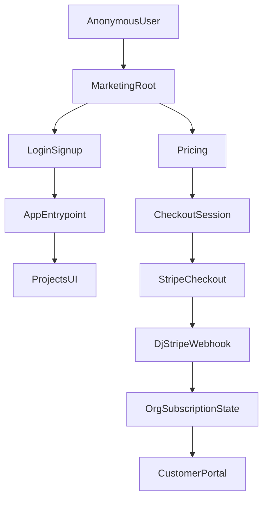

# BioRender landing clone + allauth + dj-stripe

## Scope

- **Marketing site**: new BioRender-style landing + stub pages (Pricing/LearningHub/Events/etc) served at `/`.
- **App entrypoint**: `/app/` becomes the “go to the product” entry, but existing app URLs like `/projects/…` remain valid (entrypoint-only move).
- **Auth**: replace current `/user/login/` + `/user/signup/` with `django-allauth` while preserving your email-based login and org-creation behavior.
- **Billing**: Stripe **subscriptions** via Checkout + Customer Portal, synced with `dj-stripe`, **subscription owned by `organizations.Organization`**.

## Key repo discovery (what we’ll build on)

- Django settings entrypoint is `core.settings.label_studio` via `label_studio/manage.py`.
- The logged-in UI is rendered through Django templates extending `label_studio/templates/base.html`, which loads the built React bundles from `/react-app/*`.
- Existing auth routes live in `label_studio/users/urls.py` and are handled by `label_studio/users/views.py`.

## Implementation plan

### 1) Add a new Nx “marketing” React app that clones BioRender’s landing

- Create `web/apps/marketing/` (React + Tailwind using existing monorepo setup).
- Implement sections matching BioRender’s homepage structure:
- Hero w/ primary CTA, secondary CTA
- “Used by…” logo strip
- “Join the largest…” stats band
- Feature blocks: Thousands of icons, Drag-and-drop, Custom icons
- Templates showcase section
- Testimonial block
- Footer (Product / Use cases / Company / Resources / Account)
- Add stub routes for the “full marketing shell”: `/pricing`, `/learning-hub`, `/events` (+ placeholders), with navigation working.

**Primary files (frontend)**

- `web/apps/marketing/src/app/*` (pages/layout)
- `web/apps/marketing/src/main.tsx`
- `web/apps/marketing/project.json` (Nx targets)

### 2) Serve the marketing site at `/` from Django without breaking the existing app

- Add a Django view that serves the marketing app’s `index.html` and static assets from `web/dist/apps/marketing`.
- Update routing so:
- `/` and marketing routes render the marketing SPA
- `/app/` routes to the existing “go to product” behavior (authenticated → projects, unauthenticated → login)
- Existing backend URLs (`/projects/…`, `/api/…`, `/admin/…`, etc.) remain unchanged

**Primary files (backend)**

- [`label_studio/core/urls.py`](label_studio/core/urls.py) (route `/`, `/app/`, marketing route allowlist)
- [`label_studio/core/views.py`](label_studio/core/views.py) (new marketing view + `/app/` entry behavior)
- [`label_studio/core/settings/base.py`](label_studio/core/settings/base.py) (add `MARKETING_APP_ROOT` setting similar to `REACT_APP_ROOT`)

### 3) Replace existing login/signup with `django-allauth` (keep URLs)

- Add `django-allauth` and configure:
- `django.contrib.sites`, `allauth`, `allauth.account`
- `AUTHENTICATION_BACKENDS` includes `allauth.account.auth_backends.AuthenticationBackend` alongside existing backends
- Email-first auth: disable username requirement, enforce unique emails
- Keep your URLs:
- `/user/login/` → allauth login view
- `/user/signup/` → allauth signup view
- Preserve current “organization on signup” semantics:
- Implement a custom allauth adapter (and/or signup form) that calls your existing org creation logic and sets `user.active_organization` appropriately.
- Preserve invitation-token signup (`?token=...`) behavior by propagating the token into the adapter flow.
- Preserve current anti-bot/CSRF behavior:
- Wrap the allauth login/signup views with existing `turnstile` and CSRF enforcement used in `users/views.py`.

**Primary files (backend)**

- [`label_studio/core/settings/base.py`](label_studio/core/settings/base.py) (allauth + site + account settings)
- [`label_studio/users/urls.py`](label_studio/users/urls.py) (swap handlers while keeping paths)
- `label_studio/users/allauth_adapter.py` (new)
- `label_studio/users/allauth_views.py` (new wrappers for login/signup)
- `label_studio/templates/account/login.html` / `signup.html` (new; styled to match existing)

### 4) Add Stripe subscriptions with `dj-stripe` (billing per Organization)

- Add `dj-stripe` and configure:
- Stripe API keys (test/live)
- webhook secret
- `DJSTRIPE_SUBSCRIBER_MODEL = 'organizations.Organization'`
- `DJSTRIPE_SUBSCRIBER_MODEL_REQUEST_CALLBACK` → returns `request.user.active_organization`
- Add billing endpoints:
- Create Checkout Session for a subscription (price id configured via env)
- Customer Portal session
- Wire `dj-stripe` webhook endpoint and verify signatures
- Add a minimal “Billing” page reachable from marketing/app that lets an org owner start checkout and manage subscription.

**Primary files (backend)**

- [`label_studio/core/settings/base.py`](label_studio/core/settings/base.py) (dj-stripe settings)
- [`label_studio/core/urls.py`](label_studio/core/urls.py) (mount billing + djstripe URLs)
- `label_studio/billing/apps.py` / `urls.py` / `views.py` / `services/stripe.py` (new)

### 5) Update documentation in `knowledge_map/`

- Add operational docs covering:
- Nx build/serve for marketing app
- Django routing choices (`/` marketing, `/app/` entry)
- allauth configuration + templates
- Stripe test setup, webhook config, required env vars

**New docs**

- `knowledge_map/features/marketing_site_clone.md`
- `knowledge_map/features/auth_allauth.md`
- `knowledge_map/features/billing_djstripe_subscriptions.md`
- Update `knowledge_map/ENV_TEMPLATE_REFERENCE.md` with Stripe + allauth-related env vars

### 6) Track work in GitHub Project

- Create GitHub issues for: marketing app, routing, allauth swap, dj-stripe subscriptions, docs.
- Add them to your GitHub Project board (per your workflow).

## Notes / constraints

- Because this repo already uses a custom `users.User` model and org onboarding logic, we’ll implement **allauth adapters/views** rather than trying to force the old signup flow into stock allauth templates.
- We’ll keep existing app URLs working to avoid a large breaking change; `/app/` will act as the canonical entrypoint.
