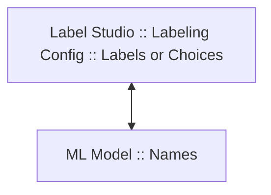

# YOLO ML backend for Label Studio

The YOLO ML backend for Label Studio is designed to integrate advanced object detection, 
segmentation, classification, and video object tracking capabilities directly into Label Studio. 

This integration allows you to leverage powerful YOLOv8 models for various machine learning tasks, 
making it easier to annotate large datasets and ensure high-quality predictions. 

<iframe width="560" height="315" src="https://www.youtube.com/embed/UyaecID1iG8?si=UQQW3mpqu2uDtt7i" title="YouTube video player" frameborder="0" allow="accelerometer; autoplay; clipboard-write; encrypted-media; gyroscope; picture-in-picture; web-share" referrerpolicy="strict-origin-when-cross-origin" allowfullscreen></iframe>

**Supported Features**

| YOLO Task Name                                               | LS Control Tag                       | Prediction Supported | LS Import Supported | LS Export Supported |
|--------------------------------------------------------------|--------------------------------------|----------------------|---------------------|---------------------|
| Object Detection                                             | `<RectangleLabels>`                  | ✅                    | YOLO, COCO          | YOLO, COCO          |
| Oriented Bounding Boxes (OBB)                                | `<RectangleLabels model_obb="true">` | ✅                    | YOLO                | YOLO                |
| Image Instance Segmentation: Polygons                        | `<PolygonLabels>`                    | ✅                    | COCO                | YOLO, COCO          |
| Image Semantic Segmentation: Masks                           | `<BrushLabels>`                      | ❌                    | Native              | Native              |
| Image Classification                                         | `<Choices>`                          | ✅                    | Native              | Native              |
| Pose Detection                                               | `<KeyPoints>`                        | ✅                    | Native              | Native              |
| Video Object Tracking                                        | `<VideoRectangle>`                   | ✅                    | Native              | Native              |
| [Video Temporal Classification](https://github.com/HumanSignal/label-studio-ml-backend/blob/master/label_studio_ml/examples/yolo/README_TIMELINE_LABELS.md) | `<TimelineLabels>`                   | ✅                    | Native              | Native              |


* **LS Control Tag**: Label Studio [control tag](https://labelstud.io/tags/) from the labeling configuration. 
* **LS Import Supported**: Indicates whether Label Studio supports Import from YOLO format to Label Studio (using the LS converter).
* **LS Export Supported**: Indicates whether Label Studio supports Export from Label Studio to YOLO format (the **Export** button on the Data Manager and using the LS converter).
* **Native**: Native means that only native Label Studio JSON format is supported.


## Before you begin 

Before you begin, you need to install the [Label Studio ML backend](https://github.com/HumanSignal/label-studio-ml-backend?tab=readme-ov-file#quickstart). 

This tutorial uses the [YOLO example](https://github.com/HumanSignal/label-studio-ml-backend/tree/master/label_studio_ml/examples/yolo).

## Quick start

1. Add `LABEL_STUDIO_URL` and `LABEL_STUDIO_API_KEY` to the `docker-compose.yml` file. 
These variables should point to your Label Studio instance and its API key, respectively. 
For more information about finding your Label Studio API key, [see our documentation](https://labelstud.io/guide/user_account#Access-token).

2. Run docker compose

    ```bash
    docker-compose up --build
    ```

3. Open Label Studio and create a new project with the following labeling config:

    ```xml
    <View>
      <Image name="image" value="$image"/>
      <RectangleLabels name="label" toName="image" model_score_threshold="0.25">
        <Label value="Car" background="blue" predicted_values="jeep,cab,limousine,truck"/>
      </RectangleLabels>
    </View>
    ```

4. Then from the **Model** page in the project settings, [connect the model](https://labelstud.io/guide/ml#Connect-the-model-to-Label-Studio). The default URL is `http://localhost:9090`. 

5. Add images or video (depending on tasks you are going to solve) to Label Studio.

6. Open any task in the Data Manager and see the predictions from the YOLO model.

## Labeling configurations

### Supported object & control tags

**Object tags**

- `<Image>` - [Image to annotate](https://labelstud.io/tags/image)
- `<Video>` - [Video to annotate](https://labelstud.io/tags/video)

**Control tags**

- `<Choices>` - [Classification](https://labelstud.io/tags/choices); image classification task
- `<RectangleLabels>` - [Bounding boxes](https://labelstud.io/tags/rectanglelabels); object detection task
- `<PolygonLabels>` - [Polygons](https://labelstud.io/tags/polygonlables); segmentation task
- `<VideoRectangle>` - [Video bounding boxes](https://labelstud.io/tags/videorectangle); object tracking task for videos
- `<KeyPointLabels>` - [Key points](https://labelstud.io/tags/keypointlabels); pose detection task
- `<TimelineLabels>` - [Temporal labels for videos](https://labelstud.io/tags/timelinelabels); multi-label temporal classification task for videos


**How to skip the control tag?**

If you don't want to use the ML backend for some control tags, 
you can force skipping by adding the `model_skip="true"` attribute to the control tag:
    
```xml
<Choices name="choice" toName="image" model_skip="true">
```

### Mixed object and control tags

You can mix different object and control tags in one project. 
The YOLO model will detect all known control tags and make predictions for them.
For example: 

```xml
<View>
  <Image name="image1" value="$image"/>
  <RectangleLabels name="label" toName="image1" model_score_threshold="0.1">
    <Label value="person" background="red"/>
    <Label value="car" background="blue"/>
  </RectangleLabels>
  
  <Image name="image2" value="$image"/>
  <Choices name="choice" toName="image2" model_score_threshold="0.1">
    <Choice value="airship"/>
    <Choice value="passenger_car"/>
  </Choices>
</View>
```

In this example, both `RectangleLabels` and `Choices` will be detected and predicted by the YOLO model.

You can also use different YOLO models for the same task to compare them visually:

```xml
<View>
  <Image name="image1" value="$image"/>
  <RectangleLabels name="label1" toName="image1" model_path="yolov8n.pt" model_score_threshold="0.1">
    <Label value="car" background="blue"/>
  </RectangleLabels>
  <RectangleLabels name="label2" toName="image1" model_path="yolov8m.pt" model_score_threshold="0.1">
    <Label value="car" background="red"/>
  </RectangleLabels>
</View>
```


### Label and choice mapping



If you use a common YOLO model, you have to add mapping between your labels and the ML model labels. 
By default, the YOLO ML backend will use the same (or lowercased) names as you specified in the `value` attribute. 

In this example the label "Jeep" will be mapped to "jeep" in the ML model:

```xml
<Choice value="Jeep"/> 
```

For more precise control you can use the `predicted_values` attribute 
to specify multiple and different labels from the ML model:

```xml
<Choice value="Car" predicted_values="jeep,cab,limousine"/>
```

<details>
<summary>Tip: How to find all YOLO model names?</summary>
<br/>
Labels are printed in the ML model logs when you start using the ML backend with the INFO logging level. 

Or you can find some labels in [YOLO_CLASSES.md](https://github.com/HumanSignal/label-studio-ml-backend/blob/master/label_studio_ml/examples/yolo/YOLO_CLASSES.md)
</details>

<details>
<summary>Tip: How to map my labels to YOLO names using an LLM?</summary>
<br/>
You can use an LLM model (e.g. ChatGPT) to automatically build mapping between Label Studio labels and ML model labels. 
Here is an example of a prompt for this. It includes 1000 labels from YOLOv8 classification model (`yolov8n-cls`).

```
**Task:**

1. **ML Model Labels:**
   - I have the following labels in my ML model:
['tench', 'goldfish', 'great_white_shark', 'tiger_shark', 'hammerhead', 'electric_ray', 'stingray', 'cock', 'hen', 'ostrich', 'brambling', 'goldfinch', 'house_finch', 'junco', 'indigo_bunting', 'robin', 'bulbul', 'jay', 'magpie', 'chickadee', 'water_ouzel', 'kite', 'bald_eagle', 'vulture', 'great_grey_owl', 'European_fire_salamander', 'common_newt', 'eft', 'spotted_salamander', 'axolotl', 'bullfrog', 'tree_frog', 'tailed_frog', 'loggerhead', 'leatherback_turtle', 'mud_turtle', 'terrapin', 'box_turtle', 'banded_gecko', 'common_iguana', 'American_chameleon', 'whiptail', 'agama', 'frilled_lizard', 'alligator_lizard', 'Gila_monster', 'green_lizard', 'African_chameleon', 'Komodo_dragon', 'African_crocodile', 'American_alligator', 'triceratops', 'thunder_snake', 'ringneck_snake', 'hognose_snake', 'green_snake', 'king_snake', 'garter_snake', 'water_snake', 'vine_snake', 'night_snake', 'boa_constrictor', 'rock_python', 'Indian_cobra', 'green_mamba', 'sea_snake', 'horned_viper', 'diamondback', 'sidewinder', 'trilobite', 'harvestman', 'scorpion', 'black_and_gold_garden_spider', 'barn_spider', 'garden_spider', 'black_widow', 'tarantula', 'wolf_spider', 'tick', 'centipede', 'black_grouse', 'ptarmigan', 'ruffed_grouse', 'prairie_chicken', 'peacock', 'quail', 'partridge', 'African_grey', 'macaw', 'sulphur-crested_cockatoo', 'lorikeet', 'coucal', 'bee_eater', 'hornbill', 'hummingbird', 'jacamar', 'toucan', 'drake', 'red-breasted_merganser', 'goose', 'black_swan', 'tusker', 'echidna', 'platypus', 'wallaby', 'koala', 'wombat', 'jellyfish', 'sea_anemone', 'brain_coral', 'flatworm', 'nematode', 'conch', 'snail', 'slug', 'sea_slug', 'chiton', 'chambered_nautilus', 'Dungeness_crab', 'rock_crab', 'fiddler_crab', 'king_crab', 'American_lobster', 'spiny_lobster', 'crayfish', 'hermit_crab', 'isopod', 'white_stork', 'black_stork', 'spoonbill', 'flamingo', 'little_blue_heron', 'American_egret', 'bittern', 'crane_(bird)', 'limpkin', 'European_gallinule', 'American_coot', 'bustard', 'ruddy_turnstone', 'red-backed_sandpiper', 'redshank', 'dowitcher', 'oystercatcher', 'pelican', 'king_penguin', 'albatross', 'grey_whale', 'killer_whale', 'dugong', 'sea_lion', 'Chihuahua', 'Japanese_spaniel', 'Maltese_dog', 'Pekinese', 'Shih-Tzu', 'Blenheim_spaniel', 'papillon', 'toy_terrier', 'Rhodesian_ridgeback', 'Afghan_hound', 'basset', 'beagle', 'bloodhound', 'bluetick', 'black-and-tan_coonhound', 'Walker_hound', 'English_foxhound', 'redbone', 'borzoi', 'Irish_wolfhound', 'Italian_greyhound', 'whippet', 'Ibizan_hound', 'Norwegian_elkhound', 'otterhound', 'Saluki', 'Scottish_deerhound', 'Weimaraner', 'Staffordshire_bullterrier', 'American_Staffordshire_terrier', 'Bedlington_terrier', 'Border_terrier', 'Kerry_blue_terrier', 'Irish_terrier', 'Norfolk_terrier', 'Norwich_terrier', 'Yorkshire_terrier', 'wire-haired_fox_terrier', 'Lakeland_terrier', 'Sealyham_terrier', 'Airedale', 'cairn', 'Australian_terrier', 'Dandie_Dinmont', 'Boston_bull', 'miniature_schnauzer', 'giant_schnauzer', 'standard_schnauzer', 'Scotch_terrier', 'Tibetan_terrier', 'silky_terrier', 'soft-coated_wheaten_terrier', 'West_Highland_white_terrier', 'Lhasa', 'flat-coated_retriever', 'curly-coated_retriever', 'golden_retriever', 'Labrador_retriever', 'Chesapeake_Bay_retriever', 'German_short-haired_pointer', 'vizsla', 'English_setter', 'Irish_setter', 'Gordon_setter', 'Brittany_spaniel', 'clumber', 'English_springer', 'Welsh_springer_spaniel', 'cocker_spaniel', 'Sussex_spaniel', 'Irish_water_spaniel', 'kuvasz', 'schipperke', 'groenendael', 'malinois', 'briard', 'kelpie', 'komondor', 'Old_English_sheepdog', 'Shetland_sheepdog', 'collie', 'Border_collie', 'Bouvier_des_Flandres', 'Rottweiler', 'German_shepherd', 'Doberman', 'miniature_pinscher', 'Greater_Swiss_Mountain_dog', 'Bernese_mountain_dog', 'Appenzeller', 'EntleBucher', 'boxer', 'bull_mastiff', 'Tibetan_mastiff', 'French_bulldog', 'Great_Dane', 'Saint_Bernard', 'Eskimo_dog', 'malamute', 'Siberian_husky', 'dalmatian', 'affenpinscher', 'basenji', 'pug', 'Leonberg', 'Newfoundland', 'Great_Pyrenees', 'Samoyed', 'Pomeranian', 'chow', 'keeshond', 'Brabancon_griffon', 'Pembroke', 'Cardigan', 'toy_poodle', 'miniature_poodle', 'standard_poodle', 'Mexican_hairless', 'timber_wolf', 'white_wolf', 'red_wolf', 'coyote', 'dingo', 'dhole', 'African_hunting_dog', 'hyena', 'red_fox', 'kit_fox', 'Arctic_fox', 'grey_fox', 'tabby', 'tiger_cat', 'Persian_cat', 'Siamese_cat', 'Egyptian_cat', 'cougar', 'lynx', 'leopard', 'snow_leopard', 'jaguar', 'lion', 'tiger', 'cheetah', 'brown_bear', 'American_black_bear', 'ice_bear', 'sloth_bear', 'mongoose', 'meerkat', 'tiger_beetle', 'ladybug', 'ground_beetle', 'long-horned_beetle', 'leaf_beetle', 'dung_beetle', 'rhinoceros_beetle', 'weevil', 'fly', 'bee', 'ant', 'grasshopper', 'cricket', 'walking_stick', 'cockroach', 'mantis', 'cicada', 'leafhopper', 'lacewing', 'dragonfly', 'damselfly', 'admiral', 'ringlet', 'monarch', 'cabbage_butterfly', 'sulphur_butterfly', 'lycaenid', 'starfish', 'sea_urchin', 'sea_cucumber', 'wood_rabbit', 'hare', 'Angora', 'hamster', 'porcupine', 'fox_squirrel', 'marmot', 'beaver', 'guinea_pig', 'sorrel', 'zebra', 'hog', 'wild_boar', 'warthog', 'hippopotamus', 'ox', 'water_buffalo', 'bison', 'ram', 'bighorn', 'ibex', 'hartebeest', 'impala', 'gazelle', 'Arabian_camel', 'llama', 'weasel', 'mink', 'polecat', 'black-footed_ferret', 'otter', 'skunk', 'badger', 'armadillo', 'three-toed_sloth', 'orangutan', 'gorilla', 'chimpanzee', 'gibbon', 'siamang', 'guenon', 'patas', 'baboon', 'macaque', 'langur', 'colobus', 'proboscis_monkey', 'marmoset', 'capuchin', 'howler_monkey', 'titi', 'spider_monkey', 'squirrel_monkey', 'Madagascar_cat', 'indri', 'Indian_elephant', 'African_elephant', 'lesser_panda', 'giant_panda', 'barracouta', 'eel', 'coho', 'rock_beauty', 'anemone_fish', 'sturgeon', 'gar', 'lionfish', 'puffer', 'abacus', 'abaya', 'academic_gown', 'accordion', 'acoustic_guitar', 'aircraft_carrier', 'airliner', 'airship', 'altar', 'ambulance', 'amphibian', 'analog_clock', 'apiary', 'apron', 'ashcan', 'assault_rifle', 'backpack', 'bakery', 'balance_beam', 'balloon', 'ballpoint', 'Band_Aid', 'banjo', 'bannister', 'barbell', 'barber_chair', 'barbershop', 'barn', 'barometer', 'barrel', 'barrow', 'baseball', 'basketball', 'bassinet', 'bassoon', 'bathing_cap', 'bath_towel', 'bathtub', 'beach_wagon', 'beacon', 'beaker', 'bearskin', 'beer_bottle', 'beer_glass', 'bell_cote', 'bib', 'bicycle-built-for-two', 'bikini', 'binder', 'binoculars', 'birdhouse', 'boathouse', 'bobsled', 'bolo_tie', 'bonnet', 'bookcase', 'bookshop', 'bottlecap', 'bow', 'bow_tie', 'brass', 'brassiere', 'breakwater', 'breastplate', 'broom', 'bucket', 'buckle', 'bulletproof_vest', 'bullet_train', 'butcher_shop', 'cab', 'caldron', 'candle', 'cannon', 'canoe', 'can_opener', 'cardigan', 'car_mirror', 'carousel', "carpenter's_kit", 'carton', 'car_wheel', 'cash_machine', 'cassette', 'cassette_player', 'castle', 'catamaran', 'CD_player', 'cello', 'cellular_telephone', 'chain', 'chainlink_fence', 'chain_mail', 'chain_saw', 'chest', 'chiffonier', 'chime', 'china_cabinet', 'Christmas_stocking', 'church', 'cinema', 'cleaver', 'cliff_dwelling', 'cloak', 'clog', 'cocktail_shaker', 'coffee_mug', 'coffeepot', 'coil', 'combination_lock', 'computer_keyboard', 'confectionery', 'container_ship', 'convertible', 'corkscrew', 'cornet', 'cowboy_boot', 'cowboy_hat', 'cradle', 'crane_(machine)', 'crash_helmet', 'crate', 'crib', 'Crock_Pot', 'croquet_ball', 'crutch', 'cuirass', 'dam', 'desk', 'desktop_computer', 'dial_telephone', 'diaper', 'digital_clock', 'digital_watch', 'dining_table', 'dishrag', 'dishwasher', 'disk_brake', 'dock', 'dogsled', 'dome', 'doormat', 'drilling_platform', 'drum', 'drumstick', 'dumbbell', 'Dutch_oven', 'electric_fan', 'electric_guitar', 'electric_locomotive', 'entertainment_center', 'envelope', 'espresso_maker', 'face_powder', 'feather_boa', 'file', 'fireboat', 'fire_engine', 'fire_screen', 'flagpole', 'flute', 'folding_chair', 'football_helmet', 'forklift', 'fountain', 'fountain_pen', 'four-poster', 'freight_car', 'French_horn', 'frying_pan', 'fur_coat', 'garbage_truck', 'gasmask', 'gas_pump', 'goblet', 'go-kart', 'golf_ball', 'golfcart', 'gondola', 'gong', 'gown', 'grand_piano', 'greenhouse', 'grille', 'grocery_store', 'guillotine', 'hair_slide', 'hair_spray', 'half_track', 'hammer', 'hamper', 'hand_blower', 'hand-held_computer', 'handkerchief', 'hard_disc', 'harmonica', 'harp', 'harvester', 'hatchet', 'holster', 'home_theater', 'honeycomb', 'hook', 'hoopskirt', 'horizontal_bar', 'horse_cart', 'hourglass', 'iPod', 'iron', "jack-o'-lantern", 'jean', 'jeep', 'jersey', 'jigsaw_puzzle', 'jinrikisha', 'joystick', 'kimono', 'knee_pad', 'knot', 'lab_coat', 'ladle', 'lampshade', 'laptop', 'lawn_mower', 'lens_cap', 'letter_opener', 'library', 'lifeboat', 'lighter', 'limousine', 'liner', 'lipstick', 'Loafer', 'lotion', 'loudspeaker', 'loupe', 'lumbermill', 'magnetic_compass', 'mailbag', 'mailbox', 'maillot_(tights)', 'maillot_(tank_suit)', 'manhole_cover', 'maraca', 'marimba', 'mask', 'matchstick', 'maypole', 'maze', 'measuring_cup', 'medicine_chest', 'megalith', 'microphone', 'microwave', 'military_uniform', 'milk_can', 'minibus', 'miniskirt', 'minivan', 'missile', 'mitten', 'mixing_bowl', 'mobile_home', 'Model_T', 'modem', 'monastery', 'monitor', 'moped', 'mortar', 'mortarboard', 'mosque', 'mosquito_net', 'motor_scooter', 'mountain_bike', 'mountain_tent', 'mouse', 'mousetrap', 'moving_van', 'muzzle', 'nail', 'neck_brace', 'necklace', 'nipple', 'notebook', 'obelisk', 'oboe', 'ocarina', 'odometer', 'oil_filter', 'organ', 'oscilloscope', 'overskirt', 'oxcart', 'oxygen_mask', 'packet', 'paddle', 'paddlewheel', 'padlock', 'paintbrush', 'pajama', 'palace', 'panpipe', 'paper_towel', 'parachute', 'parallel_bars', 'park_bench', 'parking_meter', 'passenger_car', 'patio', 'pay-phone', 'pedestal', 'pencil_box', 'pencil_sharpener', 'perfume', 'Petri_dish', 'photocopier', 'pick', 'pickelhaube', 'picket_fence', 'pickup', 'pier', 'piggy_bank', 'pill_bottle', 'pillow', 'ping-pong_ball', 'pinwheel', 'pirate', 'pitcher', 'plane', 'planetarium', 'plastic_bag', 'plate_rack', 'plow', 'plunger', 'Polaroid_camera', 'pole', 'police_van', 'poncho', 'pool_table', 'pop_bottle', 'pot', "potter's_wheel", 'power_drill', 'prayer_rug', 'printer', 'prison', 'projectile', 'projector', 'puck', 'punching_bag', 'purse', 'quill', 'quilt', 'racer', 'racket', 'radiator', 'radio', 'radio_telescope', 'rain_barrel', 'recreational_vehicle', 'reel', 'reflex_camera', 'refrigerator', 'remote_control', 'restaurant', 'revolver', 'rifle', 'rocking_chair', 'rotisserie', 'rubber_eraser', 'rugby_ball', 'rule', 'running_shoe', 'safe', 'safety_pin', 'saltshaker', 'sandal', 'sarong', 'sax', 'scabbard', 'scale', 'school_bus', 'schooner', 'scoreboard', 'screen', 'screw', 'screwdriver', 'seat_belt', 'sewing_machine', 'shield', 'shoe_shop', 'shoji', 'shopping_basket', 'shopping_cart', 'shovel', 'shower_cap', 'shower_curtain', 'ski', 'ski_mask', 'sleeping_bag', 'slide_rule', 'sliding_door', 'slot', 'snorkel', 'snowmobile', 'snowplow', 'soap_dispenser', 'soccer_ball', 'sock', 'solar_dish', 'sombrero', 'soup_bowl', 'space_bar', 'space_heater', 'space_shuttle', 'spatula', 'speedboat', 'spider_web', 'spindle', 'sports_car', 'spotlight', 'stage', 'steam_locomotive', 'steel_arch_bridge', 'steel_drum', 'stethoscope', 'stole', 'stone_wall', 'stopwatch', 'stove', 'strainer', 'streetcar', 'stretcher', 'studio_couch', 'stupa', 'submarine', 'suit', 'sundial', 'sunglass', 'sunglasses', 'sunscreen', 'suspension_bridge', 'swab', 'sweatshirt', 'swimming_trunks', 'swing', 'switch', 'syringe', 'table_lamp', 'tank', 'tape_player', 'teapot', 'teddy', 'television', 'tennis_ball', 'thatch', 'theater_curtain', 'thimble', 'thresher', 'throne', 'tile_roof', 'toaster', 'tobacco_shop', 'toilet_seat', 'torch', 'totem_pole', 'tow_truck', 'toyshop', 'tractor', 'trailer_truck', 'tray', 'trench_coat', 'tricycle', 'trimaran', 'tripod', 'triumphal_arch', 'trolleybus', 'trombone', 'tub', 'turnstile', 'typewriter_keyboard', 'umbrella', 'unicycle', 'upright', 'vacuum', 'vase', 'vault', 'velvet', 'vending_machine', 'vestment', 'viaduct', 'violin', 'volleyball', 'waffle_iron', 'wall_clock', 'wallet', 'wardrobe', 'warplane', 'washbasin', 'washer', 'water_bottle', 'water_jug', 'water_tower', 'whiskey_jug', 'whistle', 'wig', 'window_screen', 'window_shade', 'Windsor_tie', 'wine_bottle', 'wing', 'wok', 'wooden_spoon', 'wool', 'worm_fence', 'wreck', 'yawl', 'yurt', 'web_site', 'comic_book', 'crossword_puzzle', 'street_sign', 'traffic_light', 'book_jacket', 'menu', 'plate', 'guacamole', 'consomme', 'hot_pot', 'trifle', 'ice_cream', 'ice_lolly', 'French_loaf', 'bagel', 'pretzel', 'cheeseburger', 'hotdog', 'mashed_potato', 'head_cabbage', 'broccoli', 'cauliflower', 'zucchini', 'spaghetti_squash', 'acorn_squash', 'butternut_squash', 'cucumber', 'artichoke', 'bell_pepper', 'cardoon', 'mushroom', 'Granny_Smith', 'strawberry', 'orange', 'lemon', 'fig', 'pineapple', 'banana', 'jackfruit', 'custard_apple', 'pomegranate', 'hay', 'carbonara', 'chocolate_sauce', 'dough', 'meat_loaf', 'pizza', 'potpie', 'burrito', 'red_wine', 'espresso', 'cup', 'eggnog', 'alp', 'bubble', 'cliff', 'coral_reef', 'geyser', 'lakeside', 'promontory', 'sandbar', 'seashore', 'valley', 'volcano', 'ballplayer', 'groom', 'scuba_diver', 'rapeseed', 'daisy', "yellow_lady's_slipper", 'corn', 'acorn', 'hip', 'buckeye', 'coral_fungus', 'agaric', 'gyromitra', 'stinkhorn', 'earthstar', 'hen-of-the-woods', 'bolete', 'ear', 'toilet_tissue']


2. **Labeling Config:**
   - I have this labeling config from Label Studio:
   <View>
     <Image name="image" value="$image"/>
     <Choices name="choice" toName="image">
       <Choice value="Airplane"/>
       <Choice value="Car"/>
     </Choices>
   </View>

3. **Mapping Instructions:**
   - Map the labels from the Label Studio config to the closest matching ML model labels as follows:
     1. Use the `value` attribute from each `<Choice>` tag to identify the label.
     2. Find all similar and relevant labels from the ML model corresponding to each `<Choice>` label.
     3. Add a `predicted_values="<relevant_label1_from_ml_model>,<relevant_label2_from_ml_model>"` attribute inside each `<Choice>` tag using only labels from the ML model.

4. **Output:**
   - Provide the final labeling config with the `predicted_values` attribute added, using all relevant labels from the ML model, without any explanations.
```

</details>

## Supported YOLO Versions: YOLOv5, YOLO11, and others

- **YOLOv5**: This model is supported for object detection tasks. Make sure to specify `model_path="yolov5nu.pt"` (don't forget the **`u`**) to use the YOLOv5 model.

- **YOLOv8**: These models have been successfully tested with the current ML backend. Check the full list of [v8 models here](https://docs.ultralytics.com/models/yolov8/#supported-tasks-and-modes).

- **YOLO11**: YOLO11 models have also been successfully tested with this ML backend. Check the full list of [v11 models here](https://docs.ultralytics.com/models/yolo11/#supported-tasks-and-modes).

    **Warning 1**: You must upgrade the `ultralytics` package to the latest version (`pip install -U ultralytics`) or rebuild the ML backend Docker from scratch (`docker-compose build --no-cache`) if you used it before the latest Ultralytics update on **Monday, September 30, 2024**.

    **Warning 2**: YOLO11 models do not use the `v` in their naming convention. For example, use **`yolo11n.pt`** instead of `yolov11n.pt`, unlike the naming convention in YOLOv8.

- For a full list of supported YOLO versions and models, refer to the Ultralytics documentation:
  [Ultralytics Supported YOLO Models](https://docs.ultralytics.com/models/)

    **Note**: Some YOLO models listed in the Ultralytics documentation have not been tested with this ML backend, but they might still work.


## Your own custom YOLO models

You can load your own YOLO labels using the following steps:

1. Mount your model as `/app/models/<your-model>.pt` inside of your Docker.
2. Add `model_path="<your-model>.pt"` to the control tag in the labeling configuration, e.g.:

```xml
<RectangleLabels model_path="my_model.pt">
```

<details>
<summary><b>Step by step guide</b>: Using your own custom YOLOv8 model</summary>
<br/>
You can integrate your own custom-trained YOLOv8 models with the YOLO ML backend for Label Studio. 
Follow these detailed steps to set up your custom model in the ML backend Docker:

### Step 0: Install Label Studio and clone this Github repository

1. Install and run Label Studio (or see [more ways here](https://labelstud.io/guide/install)). 

```
pip install label-studio
label-studio
```

2. Clone the Label Studio ML backend repository and go to the `yolo` example folder:

```
git clone https://github.com/HumanSignal/label-studio-ml-backend.git
cd label-studio-ml-backend/examples/yolo
```

### Step 1: Prepare your custom YOLOv8 model

Ensure that your custom YOLOv8 model is saved as a `.pt` file, which is the standard format for PyTorch models. 
Let's assume your model file is named `my_custom_model.pt`.

### Step 2: Place your model

1. **Create a 'models' directory:**

   In your project root directory `yolo` (the same directory where your `docker-compose.yml` is located), 
   create a new folder named `models` and place your `my_custom_model.pt` file inside it.

   ```
   yolo/
   ├── docker-compose.yml
   ├── models/
       └── my_custom_model.pt
   ```

2. **Modify `docker-compose.yml` to mount the 'models' directory:**

   Update your `docker-compose.yml` file to include a volume that maps the local `models` directory 
   to the `/app/models` directory inside the Docker container.

   ```yaml
   services:
     yolo:
       container_name: yolo
       ...
       volumes:
         - ./models:/app/models  # Mount the local 'models' directory
       environment:
         - ALLOW_CUSTOM_MODEL_PATH=true
       ...
   ```

### Step 3: Ensure environment variables are set correctly

- **`ALLOW_CUSTOM_MODEL_PATH=true`**: Ensure this is set in your Docker environment variables to allow the ML backend to load custom model paths (it's `true` by default).
- **`LABEL_STUDIO_URL`**: This is necessary to specify the external IP or domain of your Label Studio instance. 
  If you run Label Studio and ML backend locally, you can try setting it to `LABEL_STUDIO_URL=http://host.docker.internal:8080`.
- **`LABEL_STUDIO_API_KEY`**: This is necessary to specify the API key of your Label Studio instance. 
  You can find it in Label Studio on the [User Account page](https://labelstud.io/guide/user_account#Access-token).
- **`LOG_LEVEL`**: (optional) Set the logging level for the ML backend. You can use `DEBUG`, `INFO`, `WARNING`, `ERROR`.

Example `docker-compose.yml`:

```yaml
environment:
  - ALLOW_CUSTOM_MODEL_PATH=true
  - LABEL_STUDIO_URL=http://host.docker.internal:8080
  - LABEL_STUDIO_API_KEY=your_api_key
  - LOG_LEVEL=DEBUG  # optional 
```

### Step 4: Update your Labeling Configuration in Label Studio

In your Label Studio project, specify the path to your custom model in the labeling configuration 
by adding the `model_path` parameter to the control tag you're using 
(e.g., `<RectangleLabels>`, `<PolygonLabels>`, `<Choices>`, etc.).

**Example for Object Detection with `<RectangleLabels>`:**

```xml
<View>
  <Image name="image" value="$image"/>
  <RectangleLabels 
          name="label" toName="image" 
          model_path="my_custom_model.pt" 
          model_score_threshold="0.25">
    <Label value="Cat"/>
    <Label value="Dog"/>
  </RectangleLabels>
</View>
```

**Important Notes:**

- **`model_path`**: The **`model_path`** should match the filename of your custom model and must be located in the `/app/models` directory inside the Docker container.
- **Class names mapping**: Ensure that the `value` attributes in your `<Label>` tags correspond to the **class names** your model predicts. If they differ, use the `predicted_values` attribute to map them. Example:
  ```xml
  <Label value="Cat" predicted_values="feline"/>
  <Label value="Dog" predicted_values="canine"/>
  ```
- **Where to find class names**: See ML backend logs **to know the exact class names** your model predicts, and then 
you can use these names in the `predicted_values` attribute and in the `value` of Label tags directly.

### Step 5: Restart the ML Backend

After making these changes, restart the ML backend to apply the new configuration.

```bash
docker-compose down
docker-compose up --build
```

### Step 6: Connect the ML Backend to your Label Studio project

1. Open your Label Studio instance.
2. Go to the **Settings** of your project.
3. Navigate to the **Model** tab.
4. Connect to the ML backend by entering the ML backend URL 
(if you run it locally, it's most likely `http://localhost:9090`).

### Step 7: Test your setup

Add some tasks (images or other data) to your Label Studio project and open a task in the labeling interface. 
The ML backend should now use your custom model to generate predictions.

### Common pitfalls

- **Incorrect model path:** Ensure that the `model_path` in your labeling configuration exactly matches the filename of your model inside `/app/models`.
- **Label mismatch:** Double-check that your labels in Label Studio match the classes your model predicts, or use `predicted_values` to map them.
- **Keypoints models and model_index:** If you use a keypoints model, you should specify the `model_index` parameter in each `Label` tag. 

</details>


## Training

The current Label Studio ML backend doesn't support training YOLO models. You have to do it manually on your side.
Or you can contribute to this repository and add training support for this ML backend.

<br>

-------------------

<br>


## Classification using `<Choices>`

YOLO provides a classification model and Label Studio supports this with the `Choices` control tag.

More info: https://docs.ultralytics.com/tasks/classify/

<video src="https://github.com/user-attachments/assets/30c5ce43-2c89-4ddf-a77d-9d1d75ac3419" controls="controls" style="max-width: 800px;" class="gif-border" />


### Labeling config

```xml
<View>
  <Image name="image" value="$image"/>
  <Choices name="choice" toName="image" model_score_threshold="0.25">
    <Choice value="Airplane" predicted_values="aircraft_carrier,airliner,airship,warplane"/>
    <Choice value="Car" predicted_values="limousine,minivan,jeep,sports_car,passenger_car,police_van"/>
  </Choices>
</View>
```

### Parameters

| Parameter               | Type   | Default | Description                                                                                                                                                                                                                                                                                                                                                                  |
|-------------------------|--------|---------|------------------------------------------------------------------------------------------------------------------------------------------------------------------------------------------------------------------------------------------------------------------------------------------------------------------------------------------------------------------------------|
| `model_score_threshold` | float  | 0.5     | Sets the minimum confidence threshold for detections. Objects detected with confidence below this threshold will be disregarded. Adjusting this value can help reduce false positives.                                                                                                                                                                                       |
| `model_path`            | string | None    | Path to the custom YOLO model. See more in the section [Your own custom YOLO models](#Your-own-custom-YOLO-models).                                                                                                                                                                                                                                                          |
| `choice`                | string | single  | Possible values: `single`, `single-radio`, `multiple`. If you use `choice="single"` (default) you can select only one label. The ML backend will return the label with the highest confidence using argmax strategy. If you use `choice="multiple"` you can select multiple labels. The ML backend will return all labels with confidence above the `model_score_threshold`. |


For example:
```xml
<Choices name="choice" toName="image" model_score_threshold="0.25" model_path="my_model.pt">
```

### Default model

`yolov8n-cls.pt` is the default classification model.

<br>

-------------------

<br>

## Object detection using `RectangleLabels`

YOLO models provide bounding box detection, also known as "object detection." 
Label Studio supports this with the `RectangleLabels` control tag.

YOLO OBB models are also supported.

More info: https://docs.ultralytics.com/tasks/detect/

<video src="https://github.com/user-attachments/assets/413b4650-422d-43dc-809d-51c08f0ad434" controls="controls" style="max-width: 800px;" class="gif-border" />


### Labeling config

```xml
<View>
  <Image name="image" value="$image"/>
  <RectangleLabels name="label" toName="image" model_score_threshold="0.25" opacity="0.1">
    <Label value="Person" background="red"/>
    <Label value="Car" background="blue"/>
  </RectangleLabels>
</View>
```

### Parameters

| Parameter               | Type   | Default | Description                                                                                                                                                                            |
|-------------------------|--------|---------|----------------------------------------------------------------------------------------------------------------------------------------------------------------------------------------|
| `model_score_threshold` | float  | 0.5     | Sets the minimum confidence threshold for detections. Objects detected with confidence below this threshold will be disregarded. Adjusting this value can help reduce false positives. |
| `model_path`            | string | None    | Path to the custom YOLO model. See more in the section [Your own custom YOLO models](#Your-own-custom-YOLO-models).                                                                    |
| `model_obb`             | bool   | False   | Enables Oriented Bounding Boxes (OBB) mode. Typically it uses `*-obb.pt` yolo models.                                                                                                  |

For example:
```xml
<RectangleLabels name="label" toName="image" model_score_threshold="0.25" model_path="my_model.pt">
```

### Default model

`yolov8m.pt` is the default object detection model.
`yolov8n-obb.pt` is the default OBB object detection model.

### Oriented Bounding Boxes (YOLO OBB)

Oriented (rotated) bounding boxes will be generated automatically if you use an OBB model. 
Specify `model_obb="true"` in the `RectangleLabels` tag to enable this mode:

```xml
<RectangleLabels name="label" toName="image" model_score_threshold="0.25" model_obb="true">
```

More info: https://docs.ultralytics.com/tasks/obb/

<br>

-------------------

<br>

## Segmentation using `PolygonLabels`

YOLO models provide segmentation detection, also known as "instance segmentation." 
Label Studio supports this with the `PolygonLabels` control tag.

More info: https://docs.ultralytics.com/tasks/segment/

<video src="https://github.com/user-attachments/assets/9b2447d3-392d-42be-bc7f-ef2b6c81d54c" controls="controls" style="max-width: 800px;" class="gif-border" />


### Labeling config

```xml
<View>
  <Image name="image" value="$image"/>
  <PolygonLabels name="label" toName="image" model_score_threshold="0.25" opacity="0.1">
    <Label value="Car" background="blue"/>
    <Label value="Person" background="red"/>
  </PolygonLabels>
</View>
```

### Parameters

| Parameter               | Type   | Default | Description                                                                                                                                                                            |
|-------------------------|--------|---------|----------------------------------------------------------------------------------------------------------------------------------------------------------------------------------------|
| `model_score_threshold` | float  | 0.5     | Sets the minimum confidence threshold for detections. Objects detected with confidence below this threshold will be disregarded. Adjusting this value can help reduce false positives. |
| `model_path`            | string | None    | Path to the custom YOLO model. See more in the section [Your own custom YOLO models](#Your-own-custom-YOLO-models).                                                                    |

For example:
```xml
<PolygonLabels name="label" toName="image" model_score_threshold="0.25" model_path="my_model.pt">
```

### Default model

`yolov8n-seg.pt` is the default segmentation model.

<br>

-------------------

<br>

## Keypoint detection using `KeyPointLabels`

YOLO models provide keypoint detection, also known as "pose estimation." 
Label Studio supports this with the `KeyPointLabels` control tag.

More info: [Ultralytics YOLO Keypoint Documentation](https://docs.ultralytics.com/tasks/pose/)


### Labeling config

```xml
<View>
  <RectangleLabels name="keypoints_bbox" toName="image" model_skip="true">
    <Label value="person"/>
  </RectangleLabels>
  
  <KeyPointLabels name="keypoints" toName="image"
    model_score_threshold="0.75" model_point_threshold="0.5" 
    model_add_bboxes="true" model_point_size="1"
    model_path="yolov8n-pose.pt"
  >
    <Label value="nose" predicted_values="person" model_index="0" background="red" />

    <Label value="left_eye" predicted_values="person" model_index="1" background="yellow" />
    <Label value="right_eye" predicted_values="person" model_index="2" background="yellow" />

    <Label value="left_ear" predicted_values="person" model_index="3" background="purple" />
    <Label value="right_ear" predicted_values="person" model_index="4" background="purple" />
    
    <View>
      <Label value="left_shoulder" predicted_values="person" model_index="5" background="green" />
      <Label value="left_elbow" predicted_values="person" model_index="7" background="green" />
      <Label value="left_wrist" predicted_values="person" model_index="9" background="green" />

      <Label value="right_shoulder" predicted_values="person" model_index="6" background="blue" />
      <Label value="right_elbow" predicted_values="person" model_index="8" background="blue" />
      <Label value="right_wrist" predicted_values="person" model_index="10" background="blue" />
    </View>
    
    <View>
      <Label value="left_hip" predicted_values="person" model_index="11" background="brown" />
      <Label value="left_knee" predicted_values="person" model_index="13" background="brown" />
      <Label value="left_ankle" predicted_values="person" model_index="15" background="brown" />

      <Label value="right_hip" predicted_values="person" model_index="12" background="orange" />
      <Label value="right_knee" predicted_values="person" model_index="14" background="orange" />
      <Label value="right_ankle" predicted_values="person" model_index="16" background="orange" />
    </View>
  </KeyPointLabels>
  
  <Image name="image" value="$image" />
</View>
```

### Parameters

| Parameter               | Type   | Default | Description                                                                                                                                                                    |
|-------------------------|--------|---------|--------------------------------------------------------------------------------------------------------------------------------------------------------------------------------|
| `model_path`            | string | None    | Path to the custom YOLO model. See more in the section [Your own custom YOLO models](#Your-own-custom-YOLO-models).                                                            |
| `model_score_threshold` | float  | 0.5     | Sets the minimum confidence threshold for bounding box detections. Keypoints that are related to the detected bbox with a confidence below this threshold will be disregarded. |
| `model_point_threshold` | float  | 0.0     | Minimum confidence threshold for keypoints. Keypoints with confidence below this value will be ignored.                                                                        |
| `model_add_bboxes`      | bool   | True    | Adds bounding boxes for detected keypoints. All keypoints will be grouped by parent bounding boxes on the region panel. See details in the tip below.                          |
| `model_point_size`      | float  | 1       | Size of the keypoints in pixels. Just a visual parameter.                                                                                                                      |
| `model_index`           | int    | None    | Index of the keypoint in the YOLO model output starting from 0. It's used in `Label` tags only to build mapping between a Label and an output point.                           |

For example:

```xml
<KeyPointLabels name="keypoints" toName="image"
                model_path="yolov8n-pose.pt"
                model_score_threshold="0.25" model_point_threshold="0.5" 
                model_add_bboxes="true" model_point_size="2">
```

### Default model

`yolov8n-pose.pt` is the default keypoint detection model.

### Grouping keypoints with bounding boxes

When using keypoint detection, the ML backend groups keypoints by the bounding box (bbox) associated with each detected person or object. 
You will see the grouping under the **Regions** panel on the right side of Label Studio. Note that you can drag and drop region items as necessary.

The bounding boxes are added to the prediction results by default. You can enable or disable this behavior by setting `model_add_bboxes`:

```xml
<KeyPointLabels name="keypoints" toName="image" model_add_bboxes="false">
```

<details><summary>Tip: How to only keep keypoints and discard bounding boxes?</summary>

To enable both keypoint detection and bounding box detection in the same task, you have to 
1. set `model_add_bboxes="false"` in the `KeyPointLabels` tag,
2. remove `RectangleLabels` tag.

You can use this labeling configuration to get rid of bounding boxes and keep only keypoints:

```xml
<View>
  <KeyPointLabels name="keypoints" toName="image"
    model_score_threshold="0.75" model_point_threshold="0.5" 
    model_path="yolov8n-pose.pt" model_point_size="1"
    model_add_bboxes="false"              
  >
    <Label value="nose" predicted_values="person" model_index="0" background="red" />

    <Label value="left_eye" predicted_values="person" model_index="1" background="yellow" />
    <Label value="right_eye" predicted_values="person" model_index="2" background="yellow" />

    <Label value="left_ear" predicted_values="person" model_index="3" background="purple" />
    <Label value="right_ear" predicted_values="person" model_index="4" background="purple" />
    
    <View>
      <Label value="left_shoulder" predicted_values="person" model_index="5" background="green" />
      <Label value="left_elbow" predicted_values="person" model_index="7" background="green" />
      <Label value="left_wrist" predicted_values="person" model_index="9" background="green" />

      <Label value="right_shoulder" predicted_values="person" model_index="6" background="blue" />
      <Label value="right_elbow" predicted_values="person" model_index="8" background="blue" />
      <Label value="right_wrist" predicted_values="person" model_index="10" background="blue" />
    </View>
    
    <View>
      <Label value="left_hip" predicted_values="person" model_index="11" background="brown" />
      <Label value="left_knee" predicted_values="person" model_index="13" background="brown" />
      <Label value="left_ankle" predicted_values="person" model_index="15" background="brown" />

      <Label value="right_hip" predicted_values="person" model_index="12" background="orange" />
      <Label value="right_knee" predicted_values="person" model_index="14" background="orange" />
      <Label value="right_ankle" predicted_values="person" model_index="16" background="orange" />
    </View>
  </KeyPointLabels>
  <Image name="image" value="$image" />
</View>
```

</details>

### Point mapping

For precise control, you can map keypoints to specific labels in your Label Studio configuration. 
Each keypoint can be associated with a specific part of a person or object, 
and you can define this mapping using the `model_index` and `predicted_values` attributes.

```xml
<Label value="left_eye" predicted_values="person" model_index="1" />
<Label value="right_eye" predicted_values="person" model_index="2" />
```

This configuration ensures that the keypoints detected by the YOLO model are correctly labeled in the Label Studio interface.
For pose detection models, the `model_index` attribute is used to map keypoints to specific parts of the body according to the YOLO model output:

```
0: Nose 1: Left Eye 2: Right Eye 3: Left Ear 4: Right Ear 
5: Left Shoulder 6: Right Shoulder 7: Left Elbow 8: Right Elbow 9: Left Wrist 10: Right Wrist 
11: Left Hip 12: Right Hip 13: Left Knee 14: Right Knee 15: Left Ankle 16: Right Ankle
```

### Recommendations

- **Bounding Box Visualization**: Use the `model_add_bboxes` parameter to visualize the bounding box containing the keypoints. This is especially useful when dealing with multiple detected persons or objects.
- **Threshold Adjustment**: Adjust the `model_score_threshold` and `model_point_threshold` parameters based on your dataset and the confidence level required for accurate keypoint detection.

<br>

-------------------

<br>

## Video object tracking using `VideoRectangle` 

YOLO models provide object tracking, also known as "multi-object tracking."
Label Studio supports this with the `VideoRectangle` + `Labels` control tags.

More info: https://docs.ultralytics.com/modes/track/

<video src="https://github.com/user-attachments/assets/7b0d50e6-164a-4d66-87cf-df443b77f638" controls="controls" style="max-width: 800px;" class="gif-border" />


### Labeling config

```xml
<View>
    <Video name="video" value="$video"/>
    <VideoRectangle name="box" toName="video" model_tracker="botsort" model_conf="0.25" model_iou="0.7" />
    <Labels name="label" toName="video">
      <Label value="Person" background="red"/>
      <Label value="Car" background="blue"/>
    </Labels>
</View>
```

### Trackers

https://docs.ultralytics.com/modes/track/?h=track#tracker-selection

The best tracker to use with Ultralytics YOLO depends on your specific needs.


The default tracker is [BoT-SORT](https://github.com/NirAharon/BoT-SORT), which is generally well-suited for most scenarios. 

However, if you're looking for an alternative with different strengths, 
[ByteTrack](https://github.com/ifzhang/ByteTrack) is another good choice that you can easily configure. 
ByteTrack is known for its high performance in multi-object tracking, 
especially in situations with varying object appearances and reappearances. 

Both trackers can be customized using YAML configuration files to fit your specific use cases.

You can specify the tracker in the control tag: 
* `<VideoRectangle model_tracker="botsort">`
* `<VideoRectangle model_tracker="bytetrack">`

### Parameters for bounding boxes

The tracker works with the object detection model (bounding boxes). 

The first step is to detect bounding boxes, the second step is to track them (find the same boxes among frames). 
These parameters are related to the first step - bounding box detection.

Read more about these parameters: 
https://docs.ultralytics.com/modes/track/?h=track#tracking-arguments

| Parameter       | Type   | Default   | Description                                                                                                                                                                            |
|-----------------|--------|-----------|----------------------------------------------------------------------------------------------------------------------------------------------------------------------------------------|
| `model_conf`    | float  | 0.25      | Sets the minimum confidence threshold for detections. Objects detected with confidence below this threshold will be disregarded. Adjusting this value can help reduce false positives. |
| `model_iou`     | float  | 0.7       | Intersection Over Union (IoU) threshold for Non-Maximum Suppression (NMS). Lower values result in fewer detections by eliminating overlapping boxes, useful for reducing duplicates.   |
| `model_tracker` | string | `botsort` | Sets the tracker to use for multi-object tracking. Options include `botsort`, `bytetrack`, or a custom YAML file.                                                                      |
| `model_path`    | string | None      | Path to the custom YOLO model. See more in the section [Your own custom YOLO models](#Your-own-custom-YOLO-models).                                                                    |

For example: 
```xml
<VideoRectangle name="label" toName="video" model_tracker="botsort" model_conf="0.25" model_iou="0.7" />  
```

### Parameters for trackers 

For an example of tracker parameters, see https://github.com/ultralytics/ultralytics/tree/main/ultralytics/cfg/trackers. 

The main parameter is `model_tracker` which can be set to 
* `botsort` 
* `bytetrack`
* Or the name of any custom yaml file that you place into `models` directory (do not include the file extension `.yaml` when setting this parameter).  

As long as they are available within the yaml file, you can specify tracker parameters directly from the labeling config. All parameters should be prefixed with `botsort_` or `bytetrack_`.

For example: 
```xml
<VideoRectangle 
    name="label" toName="video" 
    model_tracker="botsort" 
    botsort_track_low_thresh="0.1" botsort_track_high_thresh="0.2" 
/>  
```

### Default model

`yolov8n.pt` is the default object detection model. 

### Recommendations

* Video object tracking is a computationally intensive task. 
Small models like `yolov8n.pt` are recommended for real-time tracking, however, they may not be as accurate as larger models.

* Label Studio has timeout limits for ML backend requests. You can adjust the timeout in the Label Studio backend settings.

<!-- TODO: https://github.com/HumanSignal/label-studio/pull/5414/files#diff-20432d8093df2c0400b0f41b004a6b772b856b985fa1f5fd1e1f909247c89fc6L30 -->

* Or use the [CLI tool](#When-to-use-the-CLI) to run predictions asynchronously.

<br>

-------------------

<br>


## Video temporal classification using `TimelineLabels`

This ML backend supports temporal multi-label video classification for the [`<TimelineLabels>` control tag](https://labelstud.io/tags/timelinelabels) in Label Studio. 
There are two modes available:
- **Simple:** In the simple mode, the model uses pre-trained YOLO classes to generate predictions without additional training.  
- **Trainable:** In the [trainable mode](https://github.com/HumanSignal/label-studio-ml-backend/blob/master/label_studio_ml/examples/yolo/README_TIMELINE_LABELS.md), the model can be trained on custom labels and annotations submitted in Label Studio using few-shot learning as training is performed on a small number of annotations.  

<iframe width="560" height="315" src="https://www.youtube.com/embed/tfMn5q1tqKI?si=T5FhfImJEnWRSqpY" title="YouTube video player" frameborder="0" allow="accelerometer; autoplay; clipboard-write; encrypted-media; gyroscope; picture-in-picture; web-share" referrerpolicy="strict-origin-when-cross-origin" allowfullscreen></iframe>

### Labeling config

```xml
<View>
  <Video name="video" value="$video"/>
  <TimelineLabels 
          name="label" toName="video" 
          model_trainable="false" model_score_threshold="0.25">
    <Label value="Ball" predicted_values="soccer_ball" />
    <Label value="hamster" />
  </TimelineLabels>
</View>
```

### Model training

For more details on using the `TimelineLabels` ML backend, including training the model 
and adjusting neural network classifier parameters, please refer to 
**[README_TIMELINE_LABELS.md](https://github.com/HumanSignal/label-studio-ml-backend/blob/master/label_studio_ml/examples/yolo/README_TIMELINE_LABELS.md)**.

### Default model

`yolov8n-cls.pt` is the default classification model for simple mode.


<br>

-------------------

<br>


## Run the YOLO ML backend


### Running with Docker (recommended)

1. Start the Machine Learning backend on `http://localhost:9090` with the prebuilt image:

    ```bash
    docker-compose up
    ```

2. Validate that the backend is running

    ```bash
    $ curl http://localhost:9090/
    {"status":"UP"}
    ```

3. Create a project in Label Studio. Then from the **Model** page in the project settings, [connect the model](https://labelstud.io/guide/ml#Connect-the-model-to-Label-Studio). The default URL is `http://localhost:9090`.

### Building from source (advanced)

To build the ML backend from source, you have to clone the repository and build the Docker image:

```bash
docker-compose build
```

### Running without Docker (advanced)

To run the ML backend without Docker, you have to clone the repository and install all dependencies using pip:

```bash
python -m venv ml-backend
source ml-backend/bin/activate
pip install -r requirements-base.txt
pip install -r requirements.txt
```

Then you can start the ML backend:

```bash
label-studio-ml start ./dir_with_your_model
```

Also, you can check [Dockerfile](https://github.com/HumanSignal/label-studio-ml-backend/blob/master/label_studio_ml/examples/yolo/Dockerfile) for additional dependencies and install them manually. 

### Parameters

Check the `environment` section in the [`docker-compose.yml`](https://github.com/HumanSignal/label-studio-ml-backend/blob/master/label_studio_ml/examples/yolo/docker-compose.yml) file before running the container. 
All available parameters are listed there.

> Note: You can use lots of YOLO model parameters in labeling configurations directly, e.g. `model_path` or `model_score_threshold`.

## Command line interface for the terminal

### Overview

This Command Line Interface (CLI) tool facilitates the integration of YOLO models with Label Studio for machine learning predictions. 
It provides an alternative method for running YOLO predictions on tasks managed by Label Studio, 
particularly useful for processing long videos or large datasets. 

Running the model predictions directly from the CLI helps to avoid issues 
like connection timeouts between Label Studio and the ML backend, 
which can occur during lengthy processing times.

### When to use the CLI

When working with extensive media files such as long videos, processing times can be significant. 
Label Studio may interrupt the connection with the ML backend if the request takes too long, resulting in incomplete predictions. 

By running this CLI tool, you can execute model predictions asynchronously 
without the need for Label Studio to maintain a constant connection to the backend. 
This ensures that even large or complex tasks are processed fully, 
and predictions are saved to Label Studio using SDK once completed.

### How it works

1. **Label Studio Connection**: The tool connects to a running instance of Label Studio using the provided API key and URL.
2. **Task Preparation**: Tasks can be provided directly via a JSON file or as a list of task IDs. The tool fetches task data from Label Studio if task IDs are supplied.
3. **Model Loading**: The YOLO model is loaded and initialized based on the project’s configuration.
4. **Prediction Process**: For each task, the YOLO model generates predictions, which are then post-processed to Label Studio's expected format.
5. **Asynchronous Upload**: The generated predictions are uploaded back to Label Studio, allowing for large tasks to be processed without timing out.

### Usage

```bash
python cli.py --ls-url http://localhost:8080 --ls-api-key your_api_key --project 1 --tasks tasks.json
```

or 

```bash
python cli.py --ls-url http://localhost:8080 --ls-api-key YOUR_API_KEY --project 1 --tasks 1,2,3
```

### Parameters

- **`--ls-url`**: The URL of the Label Studio instance. Defaults to `http://localhost:8080`.
- **`--ls-api-key`**: The API key for Label Studio. Used to authenticate the connection.
- **`--project`**: The ID of the Label Studio project where the tasks are managed. Defaults to `1`.
- **`--tasks`**:

  1. The path to a JSON file containing a list of tasks or task IDs, e.g.:

    tasks_ids.json 
    ```json
    [1,2,3]
    ```
  
    tasks.json
    ```json
    [{"id": 1, "data": {"image": "https://example.com/1.jpg"}}, {"id": 2, "data": {"image": "https://example.com/2.jpg"}}]
    ```
  
  2. If a file is not provided, you can pass a comma-separated list of task IDs directly, e.g.: `1,2,3`

### Logging

Use `LOG_LEVEL=DEBUG` to get detailed logs. Example:

```bash
LOG_LEVEL=DEBUG python cli.py --ls-url http://localhost:8080 --ls-api-key YOUR_API_KEY --project 2 --tasks 1,2,3
```

## For developers

The architecture of the project and development guidelines are described in the [README_DEVELOP.md](https://github.com/HumanSignal/label-studio-ml-backend/blob/master/label_studio_ml/examples/yolo/README_DEVELOP.md) file.
