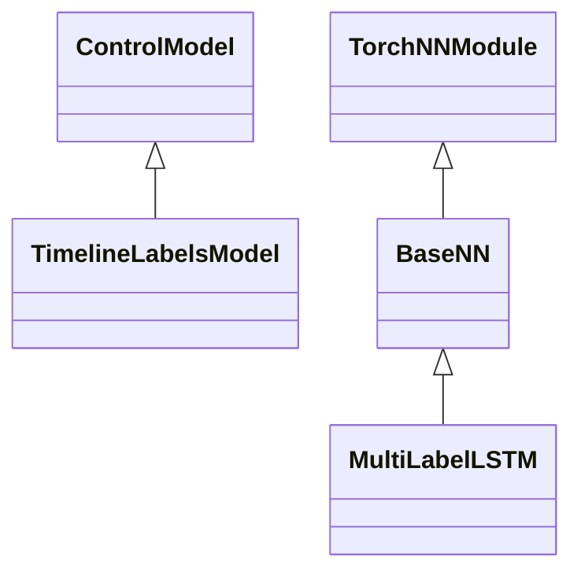
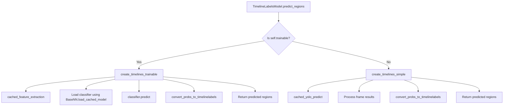
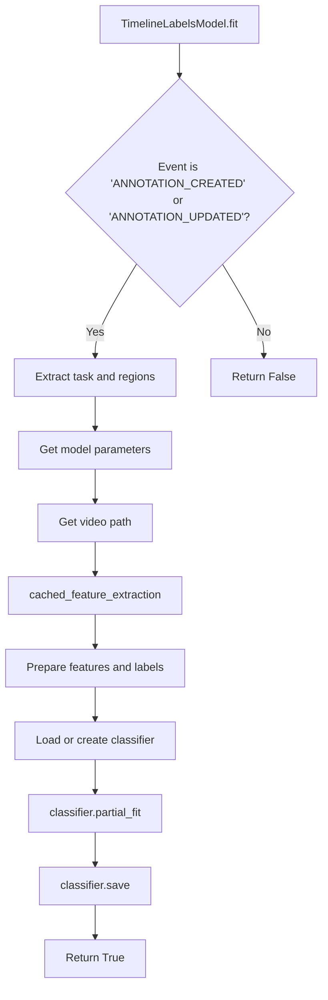

# TimelineLabels Model for Temporal Video Multi-Label Classification in Label Studio

This documentation provides a clear and comprehensive guide on how to use the TimelineLabels model 
for temporal multi-label classification of video data in Label Studio. 

By integrating an LSTM neural network on top of YOLO's classification capabilities — 
specifically utilizing features from YOLO's last layer — the model handles temporal labeling tasks. 
Users can easily customize neural network parameters directly within the labeling configuration 
to tailor the model to their specific use cases or use this model as a foundation for further development.

In trainable mode, you'll begin by annotating a few samples by hand. Each time you click **Submit**, the model will retrain on the new annotation that you've provided. Once the model begins predicting your trained labels on new tasks, it will automatically populate the timeline with the labels that it has predicted. You can validate or change these labels, and updating them will again retrain the model, helping you to iteratively improve.

<iframe width="560" height="315" src="https://www.youtube.com/embed/UyaecID1iG8?si=RHPYDfYgIWea1Odq" title="YouTube video player" frameborder="0" allow="accelerometer; autoplay; clipboard-write; encrypted-media; gyroscope; picture-in-picture; web-share" referrerpolicy="strict-origin-when-cross-origin" allowfullscreen></iframe>
<br/>

**Tip:** If you're looking for a more advanced approach to temporal classification, check out the [VideoMAE model](https://huggingface.co/docs/transformers/en/model_doc/videomae). While we don't provide an example backend for VideoMAE, you can [integrate it as your own ML backend](https://labelstud.io/guide/ml_create). 

## Installation and quickstart

Before you begin, you need to install the [Label Studio ML backend](https://github.com/HumanSignal/label-studio-ml-backend/blob/master/README.md#quickstart). 

This tutorial uses the [YOLO example](https://github.com/HumanSignal/label-studio-ml-backend/tree/master/label_studio_ml/examples/yolo). See the [main README](https://github.com/HumanSignal/label-studio-ml-backend/blob/master/label_studio_ml/examples/yolo/README.md#quick-start) for detailed instructions on setting up the YOLO-models family in Label Studio.


## Labeling configuration

```xml
<View>
    <TimelineLabels name="label" toName="video" 
        model_trainable="true"
        model_classifier_epochs="1000"
        model_classifier_sequence_size="16"
        model_classifier_hidden_size="32"
        model_classifier_num_layers="1"
        model_classifier_f1_threshold="0.95"
        model_classifier_accuracy_threshold="0.99"
        model_score_threshold="0.5"
    >
    <Label value="Ball touch" background="red"/>
    <Label value="Ball in frame" background="blue"/>
  </TimelineLabels>
  <Video name="video" value="$video" height="700" frameRate="25.0" timelineHeight="200" />
</View>
```

<span style="color:red"><b>IMPORTANT:</b></span> You must set the **`frameRate`** attribute in the `Video` tag to the correct value. 
<span style="color:red">All your videos should have the same frame rate.</span> Otherwise, the submitted annotations will be **misaligned** with videos.

## Parameters

| Parameter                             | Type   | Default | Description                                                                                                                                       |
|---------------------------------------|--------|---------|---------------------------------------------------------------------------------------------------------------------------------------------------|
| `model_trainable`                     | bool   | False   | Enables the trainable mode, allowing the model to learn from your annotations incrementally.                                                      |
| `model_classifier_epochs`             | int    | 1000    | Number of training epochs for the LSTM neural network.                                                                                            |
| `model_classifier_sequence_size`      | int    | 16      | Size of the LSTM sequence in frames. Adjust to capture longer or shorter temporal dependencies, 16 frames are about ~0.6 sec with 25 frame rate.  |
| `model_classifier_hidden_size`        | int    | 32      | Size of the LSTM hidden state. Modify to change the capacity of the LSTM.                                                                         |
| `model_classifier_num_layers`         | int    | 1       | Number of LSTM layers. Increase for a deeper LSTM network.                                                                                        |
| `model_classifier_f1_threshold`       | float  | 0.95    | F1 score threshold for early stopping during training. Set to prevent overfitting.                                                                |
| `model_classifier_accuracy_threshold` | float  | 1.00    | Accuracy threshold for early stopping during training. Set to prevent overfitting.                                                                |
| `model_score_threshold`               | float  | 0.5     | Minimum confidence threshold for predictions. Labels with confidence below this threshold will be disregarded.                                    |
| `model_path`                          | string | None    | Path to the custom YOLO model. See more in the section [Your own custom models](https://github.com/HumanSignal/label-studio-ml-backend/blob/master/label_studio_ml/examples/yolo/README.md#your-own-custom-yolo-models)                                                                      |

**Note:** You can customize the neural network parameters directly in the labeling configuration by adjusting the attributes in the `<TimelineLabels>` tag.

## Using the model

### Simple mode

In the simple mode, the model uses pre-trained YOLO classes to generate predictions without additional training.

- **When to Use**: Quick setup without the need for custom training. It starts generating predictions immediately.
- **Configuration**: Set `model_trainable="false"` in the labeling config (or omit it as `false` is the default).
- **Example**:

  ```xml
  <View>
    <Video name="video" value="$video" height="700" frameRate="25.0" timelineHeight="200" />
    <TimelineLabels name="label" toName="video" model_trainable="false">
      <Label value="Ball" predicted_values="soccer_ball"/>
      <Label value="tiger_shark" />
    </TimelineLabels>
  </View>
  ```

### Trainable mode

The trainable mode enables the model to learn from your annotations incrementally.

It uses the pre-trained YOLO classification model and a custom LSTM neural network on the top 
to capture temporal dependencies in video data. The LSTM model works from scratch, 
so it requires about 10-20 well-annotated videos 500 frames each (~20 seconds) to start making meaningful predictions.

- **When to Use**: When custom labels or improved accuracy are needed relative to simple mode.
- **Configuration**: Set `model_trainable="true"` in the labeling config.
- **Training Process**:
  - Start annotating videos using the `TimelineLabels` tag.
  - After submitting the first annotation, the model begins training.
  - The `partial_fit()` method allows the model to train incrementally with each new annotation.
- **Requirements**: Approximately 10-20 annotated tasks are needed to achieve reasonable performance.

**Note**: The `predicted_values` attribute in the `<Label>` tag doesn't make sense for trainable models.

**Example**:

```xml
<View>
    <Video name="video" value="$video" height="700" frameRate="25.0" timelineHeight="200" />
    <TimelineLabels name="label" toName="video" 
                    model_trainable="true"
                    model_classifier_epochs="1000"
                    model_classifier_sequence_size="16"
                    model_classifier_hidden_size="32"
                    model_classifier_num_layers="1"
                    model_classifier_f1_threshold="0.95"
                    model_classifier_accuracy_threshold="0.99"
                    model_score_threshold="0.5">
      <Label value="Ball in frame"/>
      <Label value="Ball touch"/>
    </TimelineLabels>
</View>
```

## How the trainable model works

The trainable mode uses a custom implementation of the temporal LSTM classification model. 
The model is trained incrementally with each new annotation submit or update, 
and it generates predictions for each frame in the video.

### 1. Feature extraction with YOLO

- **Pre-trained YOLO model**: Uses a YOLO classification model (e.g. `yolov8n-cls.pt`) to extract features from video frames.
- **Layer modification**: The model removes the last classification layer to use the feature representations from the penultimate layer (see `utils/neural_nets.py::cached_feature_extraction()`).
- **Cached predictions**: Uses caching to store YOLO intermediate feature extractions for efficiency and incremental training on the fly.

#### Custom YOLO models for feature extraction

You can load your own YOLO models using the steps described in the [main README](https://github.com/HumanSignal/label-studio-ml-backend/blob/master/label_studio_ml/examples/yolo/README.md#your-own-custom-yolo-models).
However, it should have similar architecture as `yolov8-cls` models. See `utils/neural_nets.py::cached_feature_extraction()` for more details.

#### Cache folder 

It's located in `/app/cache_dir` and stores the cached intermediate features from the last layer of the YOLO model. 
The cache is used for incremental training on the fly and prediction speedup.

### 2. LSTM Neural Network

- **Purpose**: Captures temporal dependencies in video data by processing sequences of feature vectors from the last layer of YOLO.
- **Architecture**:
  - **Input layer**: Takes feature vectors from YOLO.
  - **Fully connected layer**: Reduces dimensionality.
  - **Layer normalization and dropout**: Improves training stability and prevents overfitting.
  - **LSTM layer**: Processes sequences to model temporal relationships.
  - **Output layer**: Generates multi-label predictions for each time step.
- **Loss function**: Uses binary cross-entropy loss with logits for multi-label classification and the weight decay for L2 regularization.

### 3. Incremental training with `partial_fit()`

- **Functionality**: Allows the model to update its parameters with each new annotation.
- **Process**:
  - Extracts features and labels from the annotated video using `utils/converter.py::convert_timelinelabels_to_probs()`.
  - Pre-processes data into sequences suitable for LSTM input split by `model_classifier_sequence_size` chunks.
  - Trains the model incrementally, using early stopping based on F1 score and accuracy thresholds.
- **Advantages**:
  - **Few-shot learning**: Capable of learning from a small number of examples.
  - **Avoids overfitting**: Early stopping using F1 score and accuracy prevents the model from overfitting on limited data.

### Limitations and considerations

- **Not a final production model**: While promising, the model is primarily a demo and may require further validation for production use.
- **Performance depends on data**: Requires sufficient and diverse annotations (at least 10-20 annotated tasks) to start performing.
- **Parameter sensitivity**: Adjusting neural network parameters may significantly impact performance.
- **Early stop on training data**: The model uses early stopping based on the F1 score and accuracy on the training data. This may lead to overfitting on the training data. It was made because of the lack of validation data when updating on one annotation.
- **YOLO model limitations**: The model uses a pre-trained YOLO model trained on object classification tasks for feature extraction, which may not be optimal for all use cases such as event detection. This approach doesn't tune the YOLO model, it trains only the LSTM piece upon the YOLO last layer.
- **Label balance**: The model may struggle with imbalanced labels. Ensure that the labels are well-distributed in the training data. Consider modifying the loss function (`BCEWithLogitsLoss`) and using class pos weights to address this issue.
- **Training on all daa**: Training on all data is not yet implemented, so the model trains only on the last annotation. See `timeline_labels.py::fit()` for more details. 

## Example use case: detecting a ball in football videos

### Setup

1. **Labeling configuration**:

   ```xml
   <View>
      <TimelineLabels name="videoLabels" toName="video">
        <Label value="Ball touch" background="red"/>
        <Label value="Ball in frame" background="blue"/>
      </TimelineLabels>
      <Video name="video" value="$video" height="700" timelineHeight="200" frameRate="25.0" />
    </View>
   ```

2. **Connect the model Backend**:

    Create a new project, go to **Settings > Model** and add the YOLO backend.
     1. Navigate to the `yolo` folder in this repository in your terminal.
     2. Update your `docker-compose.yml` file.
     3. Execute `docker compose up` to run the backend. 
     4. Connect this backend to your Label Studio project in the project settings. Make sure that **Interactive Preannotations** is OFF (this is the default). 

### Annotation and training

1. **Annotate videos**:

   - Upload football videos to the project.
   - Use the [`<TimelineLabels>` control tag](https://labelstud.io/tags/timelinelabels) to label time intervals where the ball is visible in the frame.

2. **Model training**:

   - After submitting annotations, the model begins training incrementally.
   - Continue annotating until the model starts making accurate predictions.

3. **Review predictions**:

   - The model suggests labels for unannotated videos.
   - Validate and correct predictions to further improve the model.

## Adjusting training parameters and resetting the model

If the model is not performing well, consider modifying the LSTM and classifier training parameters in the labeling config. These parameters
start with the `model_classifier_` prefix.

The model will be **reset** after changing these parameters:
 - `model_classifier_sequence_size`
 - `model_classifier_hidden_size`
 - `model_classifier_num_layers`
 - New labels added or removed from the labeling config

So you may need to update (click **Update**) on annotations to see improvements.

If you want to modify more parameters, you can do it directly in the code in `utils/neural_nets.py::MultiLabelLSTM`.

If you need to reset the model completely, you can remove the model file from `/app/models`. 
See `timeline_labels.py::get_classifier_path()` for the model path. Usually it starts with the `timelinelabels-` prefix.  

## Debug

To debug the model, you should run it with the `LOG_LEVEL=DEBUG` environment variable (see `docker-compose.yml`),
then check the logs in the (docker) console. 

## Convert TimelineLabels regions to label arrays and back

There are two main functions to convert the TimelineLabels regions to label arrays and back:
- `utils/converter.py::convert_timelinelabels_to_probs()` - Converts TimelineLabels regions to label arrays
- `utils/converter.py::convert_probs_to_timelinelabels()` - Converts label arrays to TimelineLabels regions

Each row in the label array corresponds to a frame in the video. 
The label array is a binary matrix where each column corresponds to a label. 
If the label is present in the frame, the corresponding cell is set to `1`, otherwise `0`.

For example: 
```
[
    [0, 0, 1], 
    [0, 1, 0], 
    [1, 0, 0]
]
```

This corresponds to the labels `[label3, label2, label1]` in the frames 1, 2, 3.

See `tests/test_timeline_labels.py::test_convert_probs_to_timelinelabels()` for more examples.

<br>
<br>

-----------

<br>
<br>

## For developers

This guide provides an in-depth look at the architecture and code flow of the TimelineLabels ML backend for Label Studio. It includes class inheritance diagrams and method call flowcharts to help developers understand how the components interact. Additionally, it offers explanations of key methods and classes, highlighting starting points and their roles in the overall workflow.

### Class inheritance diagram

The following diagram illustrates the class inheritance hierarchy in the TimelineLabels ML backend.



- **`ControlModel`**: Base class for control tags in Label Studio.
- **`TimelineLabelsModel`**: Inherits from `ControlModel` and implements specific functionality for the `<TimelineLabels>` tag.
- **`torch.nn.Module`**: Base class for all neural network modules in PyTorch.
- **`BaseNN`**: Custom base class for neural networks, inherits from `torch.nn.Module`.
- **`MultiLabelLSTM`**: Inherits from `BaseNN`, implements an LSTM neural network for multi-label classification.

### Method call flowcharts

#### Prediction workflow

The following flowchart depicts the method calls during the prediction process.



#### Training workflow

The following flowchart shows the method calls during the training process.



### Code structure and explanations

#### TimelineLabelsModel class

**File**: `timeline_labels.py`

The `TimelineLabelsModel` class extends the `ControlModel` base class and implements functionality specific to the `<TimelineLabels>` control tag.

**Key methods:**

- **`is_control_matched(cls, control)`**: Class method that checks if the provided control tag matches the `<TimelineLabels>` tag.

- **`create(cls, *args, **kwargs)`**: Class method that creates an instance of the model, initializing attributes like `trainable` and `label_map`.

- **`predict_regions(self, video_path)`**: Main method called during prediction. Determines whether to use the simple or trainable prediction method based on the `trainable` attribute.

  - **`create_timelines_simple(self, video_path)`**: Uses pre-trained YOLO classes for prediction without additional training.

    - Calls `cached_yolo_predict` to get predictions from the YOLO model.
    - Processes frame results to extract probabilities.
    - Converts probabilities to timeline labels.

  - **`create_timelines_trainable(self, video_path)`**: Uses the custom-trained LSTM neural network for prediction.

    - Calls `cached_feature_extraction` to extract features from the video.
    - Loads the trained classifier model.
    - Uses the classifier to predict probabilities.
    - Converts probabilities to timeline labels.

- **`fit(self, event, data, **kwargs)`**: Called when new annotations are created or updated. Handles the incremental training of the LSTM model.

  - Extracts features and labels from the annotated video.
  - Preprocesses data for LSTM input.
  - Loads or initializes the classifier.
  - Calls `partial_fit` on the classifier to update model parameters.
  - Saves the updated classifier model.

- **`get_classifier_path(self, project_id)`**: Generates the file path for storing the classifier model based on the project ID and model name.

#### Neural network classes

##### BaseNN class

**File**: `neural_nets.py`

The `BaseNN` class serves as a base class for neural network models, providing common methods for saving, loading, and managing label mappings.

**Key methods:**

- **`set_label_map(self, label_map)`**: Stores the label mapping dictionary.

- **`get_label_map(self)`**: Retrieves the label mapping dictionary.

- **`save(self, path)`**: Saves the model to the specified path using `torch.save`.

- **`load(cls, path)`**: Class method to load a saved model from the specified path.

- **`load_cached_model(cls, model_path)`**: Loads a cached model if it exists, otherwise returns `None`.

##### MultiLabelLSTM class

**File**: `neural_nets.py`

The `MultiLabelLSTM` class inherits from `BaseNN` and implements an LSTM neural network for multi-label classification.

**Key methods:**

- **`__init__(...)`**: Initializes the neural network layers and parameters, including input size, hidden layers, dropout, and optimizer settings.

- **`forward(self, x)`**: Defines the forward pass of the network.

  - Reduces input dimensionality using a fully connected layer.
  - Applies layer normalization and dropout.
  - Passes data through the LSTM layer.
  - Applies a fully connected layer to generate output predictions.

- **`preprocess_sequence(self, sequence, labels=None, overlap=2)`**: Prepares input sequences and labels for training by splitting and padding them.

- **`partial_fit(self, sequence, labels, ...)`**: Trains the model incrementally on new data.

  - Pre-processes the input sequence.
  - Creates a DataLoader for batching.
  - Runs the training loop with early stopping based on accuracy and F1 score thresholds.

- **`predict(self, sequence)`**: Generates predictions for a given input sequence.

  - Splits the sequence into chunks.
  - Passes data through the model in evaluation mode.
  - Concatenates outputs to match the original sequence length.

### Starting points and execution flow

#### Prediction process

1. **Prediction request**: When a prediction is requested for a video, `TimelineLabelsModel.predict_regions(video_path)` is called.

2. **Determine mode**:

   - **Trainable mode** (`self.trainable == True`): Calls `create_timelines_trainable(video_path)`.

     - Extracts features using `cached_feature_extraction`.
     - Loads the trained classifier model using `BaseNN.load_cached_model`.
     - Predicts probabilities with `classifier.predict(yolo_probs)`.
     - Converts probabilities to timeline labels using `convert_probs_to_timelinelabels`.

   - **Simple mode** (`self.trainable == False`): Calls `create_timelines_simple(video_path)`.

     - Gets YOLO predictions using `cached_yolo_predict`.
     - Processes frame results to extract probabilities.
     - Converts probabilities to timeline labels using `convert_probs_to_timelinelabels`.

3. **Return predictions**: The method returns a list of predicted regions with labels and timestamps.

#### Training process

1. **Event Trigger**: The `fit(event, data, **kwargs)` method is called when an annotation event occurs (e.g., 'ANNOTATION_CREATED' or 'ANNOTATION_UPDATED').

2. **Event Handling**:

   - Checks if the event is relevant for training.
   - Extracts the task and annotation data.

3. **Parameter Extraction**: Retrieves model parameters from the control tag attributes, such as epochs, sequence size, hidden size, and thresholds.

4. **Data Preparation**:

   - Gets the video path associated with the task.
   - Extracts features from the video using `cached_feature_extraction`.
   - Converts annotations to labels suitable for training.

5. **Model Loading or Initialization**:

   - Attempts to load an existing classifier model using `BaseNN.load_cached_model`.
   - If no model exists or parameters have changed, initializes a new `MultiLabelLSTM` model.

6. **Training**:

   - Calls `classifier.partial_fit(features, labels, ...)` to train the model incrementally.
   - Training includes early stopping based on accuracy and F1 score thresholds to prevent overfitting.

7. **Model Saving**: Saves the trained model to disk using `classifier.save(path)`.

## Utilities and helper functions

**Cached Prediction and Feature Extraction**:

- **`cached_yolo_predict(yolo_model, video_path, cache_params)`**: Uses joblib's `Memory` to cache YOLO predictions, avoiding redundant computations.

- **`cached_feature_extraction(yolo_model, video_path, cache_params)`**: Extracts features from the YOLO model by hooking into the penultimate layer and caches the results.

**Data Conversion Functions**:

- **`convert_probs_to_timelinelabels(probs, label_map, threshold)`**: Converts probability outputs to timeline labels suitable for Label Studio.

- **`convert_timelinelabels_to_probs(regions, label_map, max_frame)`**: Converts annotated regions back into a sequence of probabilities for training.

## Conclusion

The TimelineLabels ML backend integrates seamlessly with Label Studio to provide temporal multi-label classification capabilities for video data. The architecture leverages pre-trained YOLO models for feature extraction and enhances them with an LSTM neural network for capturing temporal dependencies.

Understanding the class hierarchies and method flows is crucial for developers looking to extend or modify the backend. By following the starting points and execution flows outlined in this guide, developers can navigate the codebase more effectively and implement custom features or optimizations.

**Note**: For further development or contributions, please refer to the [`README_DEVELOP.md`](https://github.com/HumanSignal/label-studio-ml-backend/blob/master/label_studio_ml/examples/yolo/README_DEVELOP.md) file, which provides additional guidelines and architectural details.