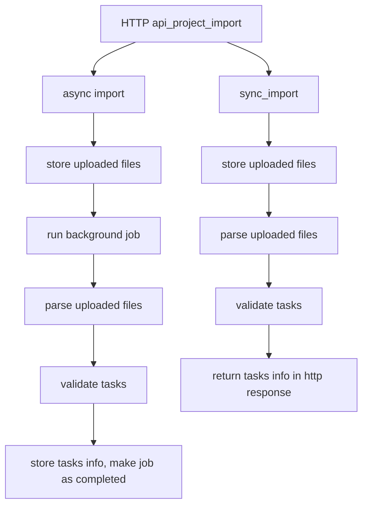

# Data import
Data import app contains models and apis for serving Import pages in DM or during project creation

### Async import

```mermaid
flowchart TD
    A[HTTP api_project_import] --> B[async import]
    A --> C[sync_import]
    B --> D[store uploaded files]
    D --> E[run background job]
    E --> F[parse uploaded files]
    F --> G[validate tasks]
    G --> H[store tasks info, make job as completed]
    C --> I[store uploaded files]
    I --> J[parse uploaded files]
    J --> K[validate tasks]
    K --> L[return tasks info in http response]
```
