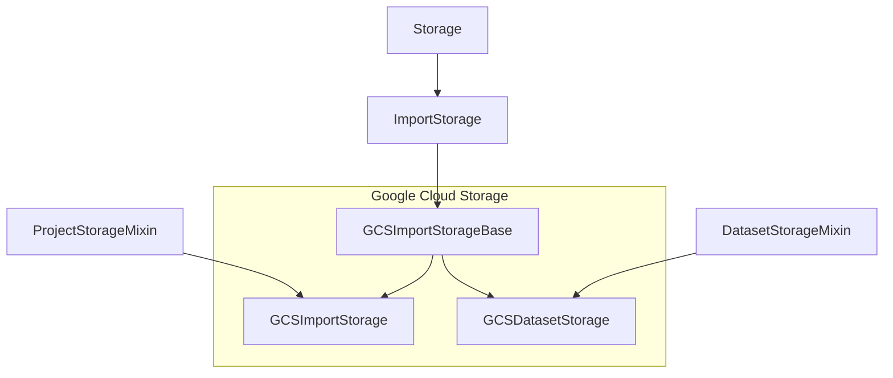
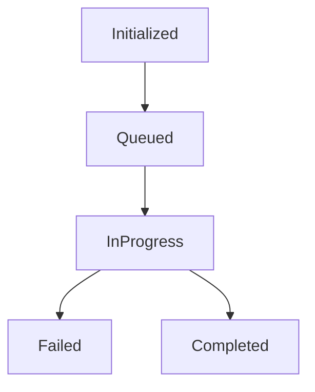

# Cloud Storages

There are 3 basic types of cloud storages:

1. Import Storages (aka Source Cloud Storages)
2. Export Storages (aka Target Cloud Storages)
3. Dataset Storages (available in enterprise)

## Basic hierarchy 

### Import and Dataset Storages 
 
This diagram is based on Google Cloud Storage (GCS) and other storages are implemented the same way.
  

## Storage statuses and how they are processed

Storage (Import and Export) have different statuses of synchronization (see `class StorageInfo.Status`):

1. Initialized: storage was added, but never synced, it is enough to start using URI links resolving
2. Queued: sync job is in the queue, but not yet started
3. In progress: sync job is running
4. Failed: sync job stopped, some errors occurred
5. Completed: sync job completed successfully

Also StorageInfo contains counters and some debug info that will be displayed in storages:
* last_sync - time of the successful last sync 
* last_sync_count - objects that were synced successfully
* last_sync_job - rqworker job id 
* status - string with StorageInfo.Status.choices 
* traceback - last error traceback
* meta - dict with any advanced information, it includes:
  - tasks_existed - already existed tasks in the project, that won't be synced
  - time_last_ping - sync process can be long, but it should write updated `time_last_ping` every 10 (`settings.STORAGE_IN_PROGRESS_TIMER`) seconds. When Storage API tries to get the storage, it checks time_last_ping and if there are no updates, it marks the sync process as failed (see section "Expected and unexpected sync terminations").

### Expected and unexpected sync terminations

All these states are presented in opensource and enterprise editions for code compatibility. Status processing might be tricky, especially in cases when sync process was killed unexpectedly. There are typical situations when this happens: 

1. An exception occurred, it's a soft termination and in this case the sync job has `Failed` status. 
2. OOM error happened => RQ worker job was killed => `storage_background_failure` wasn't called.
3. RQ workers were redeployed => `storage_background_failure` wasn't called.
4. RQ workers were killed manually => `storage_background_failure` wasn't called.
5. Job was removed from RQ Queue => it's not a failure, but we need to update storage status somehow. 

To process these cases correctly, we have to check all these conditions in `ensure_storage_status` when Storage list API is retrieved. 