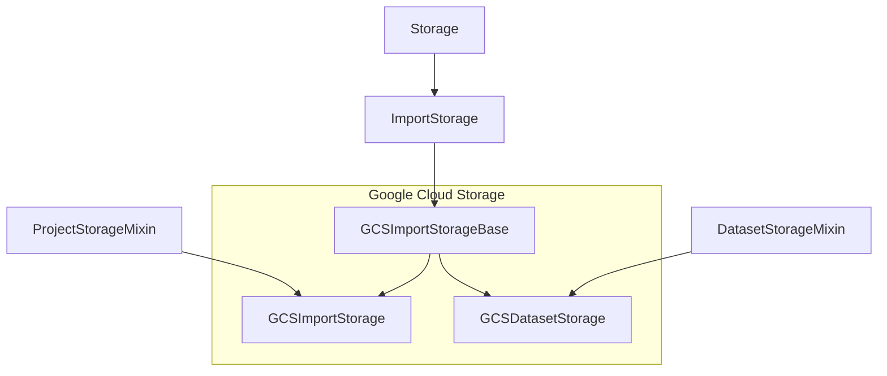

# Cloud Storages

There are 3 basic types of cloud storages:

1. Import Storages (aka Source Cloud Storages)
2. Export Storages (aka Target Cloud Storages)
3. Dataset Storages (available in enterprise)

## Basic hierarchy 

### Import and Dataset Storages 
 
This diagram is based on Google Cloud Storage (GCS) and other storages are implemented the same way.
  
