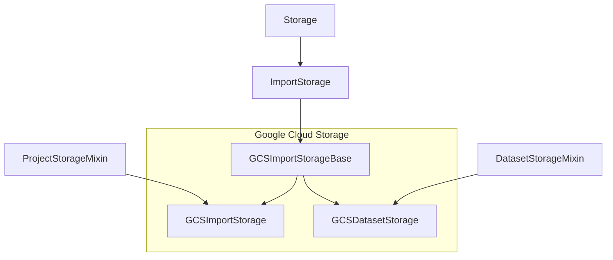
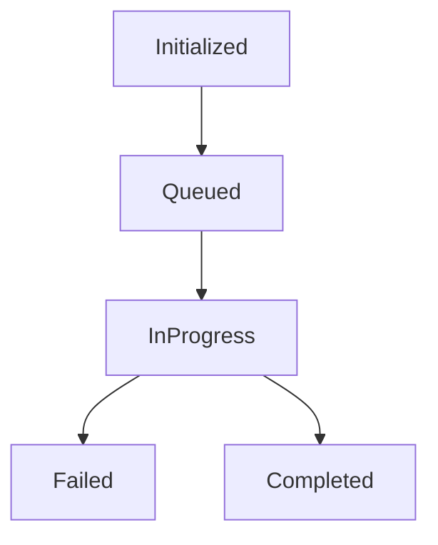

# Cloud Storages

There are 3 basic types of cloud storages:

1. Import Storages (aka Source Cloud Storages)
2. Export Storages (aka Target Cloud Storages)
3. Dataset Storages (available in enterprise)

Also Label Studio has Persistent storages where LS storage export files, user avatars and UI uploads. Do not confuse `Cloud Storages` and `Persistent Storage`, they have completely different codebase and tasks. Cloud Storages are implemented in `io_storages`, Persistent Storage uses django-storages and it is installed in Django settings environment variables (see `base.py`). 


## Basic hierarchy 

### Import and Dataset Storages 
 
This diagram is based on Google Cloud Storage (GCS) and other storages are implemented the same way.
  



## How validate_connection() works

Run this command with try/except: 
1. Get client
2. Get bucket
3. For source storage only: get any file from specified prefix
4. For target storage: we don't need to check prefix, because it should be created automatically when annotation is written

Target storages use the same validate_connection() function, but without any prefix.


## Google Cloud Storage (GCS)

### Credentials 

There are two methods for setting GCS credentials:
1. Through the Project => Cloud Storage settings in the Label Studio user interface.
2. Through Google Application Default Credentials (ADC). This involves the following steps:

   2.1. Leave the Google Application Credentials field in the Label Studio UI blank.
   
   2.2. Set an environment variable which will apply to all Cloud Storages. This can be done using the following command:
   ```bash
   export GOOGLE_APPLICATION_CREDENTIALS=google_credentials.json
   ```
   2.3. Alternatively, use the following command:
   ```bash
   gcloud auth application-default login
   ```
   2.4. Another option is to use credentials provided by the Google App Engine or Google Compute Engine metadata server, if the code is running on either GAE or GCE.

Note: If Cloud Storage credentials are set in the Label Studio UI, these will take precedence over other methods.

     


## Storage statuses and how they are processed

Storage (Import and Export) have different statuses of synchronization (see `class StorageInfo.Status`):

1. Initialized: storage was added, but never synced; sufficient for starting URI link resolving
2. Queued: sync job is in the queue, but not yet started
3. In progress: sync job is running
4. Failed: sync job stopped, some errors occurred
5. Completed: sync job completed successfully



Additionally, StorageInfo contains counters and debug information that will be displayed in storages:

* last_sync - time of the last successful sync
* last_sync_count - number of objects that were successfully synced
* last_sync_job - rqworker job ID
* status - string with StorageInfo.Status.choices
* traceback - last error traceback
* meta - dictionary with advanced information, including:
  - tasks_existed - pre-existing tasks in the project that will not be synced
  - time_last_ping - the sync process can be lengthy, but it should update time_last_ping every 10 (settings.STORAGE_IN_PROGRESS_TIMER) seconds. When the Storage API tries to fetch the storage, it checks time_last_ping and marks the sync process as failed if there are no updates (see the section "Expected and Unexpected Sync Terminations").

### Expected and unexpected sync terminations

All these states are present in both the open-source and enterprise editions for code compatibility. Status processing can be challenging, especially when the sync process is terminated unexpectedly. Typical situations when this happens include:

1. An exception occurred, it's a soft termination and in this case the sync job has `Failed` status. 
2. OOM error happened => RQ worker job was killed => `storage_background_failure` wasn't called.
3. RQ workers were redeployed => `storage_background_failure` wasn't called.
4. RQ workers were killed manually => `storage_background_failure` wasn't called.
5. Job was removed from RQ Queue => it's not a failure, but we need to update storage status somehow. 

To handle these cases correctly, all these conditions must be checked in ensure_storage_status when the Storage List API is retrieved.