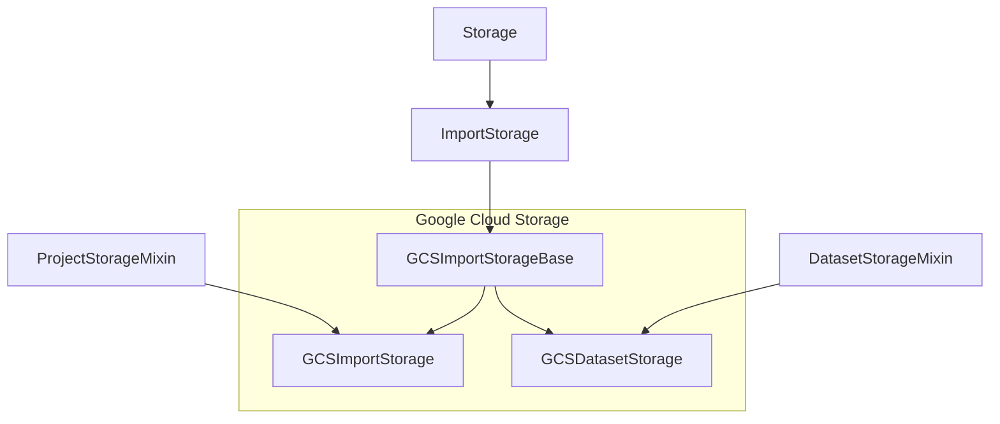

# Cloud Storages

There are 3 basic types of cloud storages:

1. Import Storages (aka Source Cloud Storages)
2. Export Storages (aka Target Cloud Storages)
3. Dataset Storages (available in enterprise)

## Basic hierarchy 

### Import and Dataset Storages 
 
This diagram is based on Google Cloud Storage (GCS) and other storages are implemented the same way.
  

## Storage status and how they process 

Storage (Import and Export) have different statuses of synchronization (see `Storage.Status`):

1. Initialized
2. Queued
3. In progress
4. Failed
5. Completed

### Expected and unexpected sync terminations

All these states are presented in opensource and enterprise editions for code compatibility. Status processing might be tricky, especially in cases when sync process was killed unexpectedly. There are typical situations when this happens: 

1. An exception occurred, it's a soft termination and in this case the sync job has `Failed` status. 
2. OOM error happened => RQ worker job was killed =>  `storage_background_failure` wasn't called.
3. RQ workers were redeployed => `storage_background_failure` wasn't called.
4. RQ workers were killed manually => `storage_background_failure` wasn't called.
5. Job was removed from RQ Queue => it's not a failure, but we need to update storage status somehow. 

To process these cases correctly, we have to check all these conditions in `ensure_job_and_storage_status` when Storage list API is retrieved. 