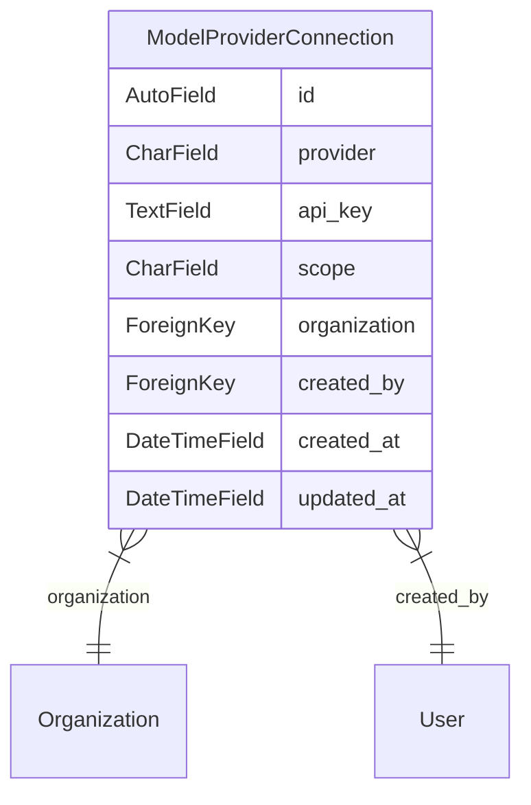

# ML Model Providers

Currently supporting a feature in [Label Studio Enterprise](https://github.com/HumanSignal/label-studio-enterprise).

## ModelProviderConnection

Holds the API keys for an LLM provider. These can belong to a user or an organization.


# Diagram




---
generated by:
```bash
pip install django-diagram
python -m django_diagram --settings=core.settings.label_studio --app=ml_models --output=ml_models/README.md
```

