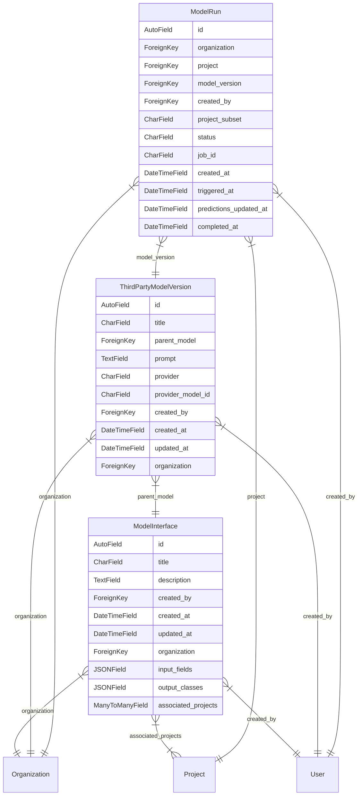

# ML Models

Currently supporting a feature in [Label Studio Enterprise](https://github.com/HumanSignal/label-studio-enterprise).

## ModelInterface

Defines a "type signature" for the inputs and outputs for an LLM call as related to a Label Studio project.

## ModelVersion

Defines an "implementation" of an LLM call, given any user input needed. Currently, the only one implemented is a third-party model (such as OpenAI) with a chat prompt.

## ModelRun

Defines a run of a ModelVersion on a chosen set of tasks on a project. Adds that ModelVersion's outputs to the project as predictions.

# Diagram




---
generated by:
```bash
pip install django-diagram
python -m django_diagram --settings=core.settings.label_studio --app=ml_models --output=ml_models/README.md
```
