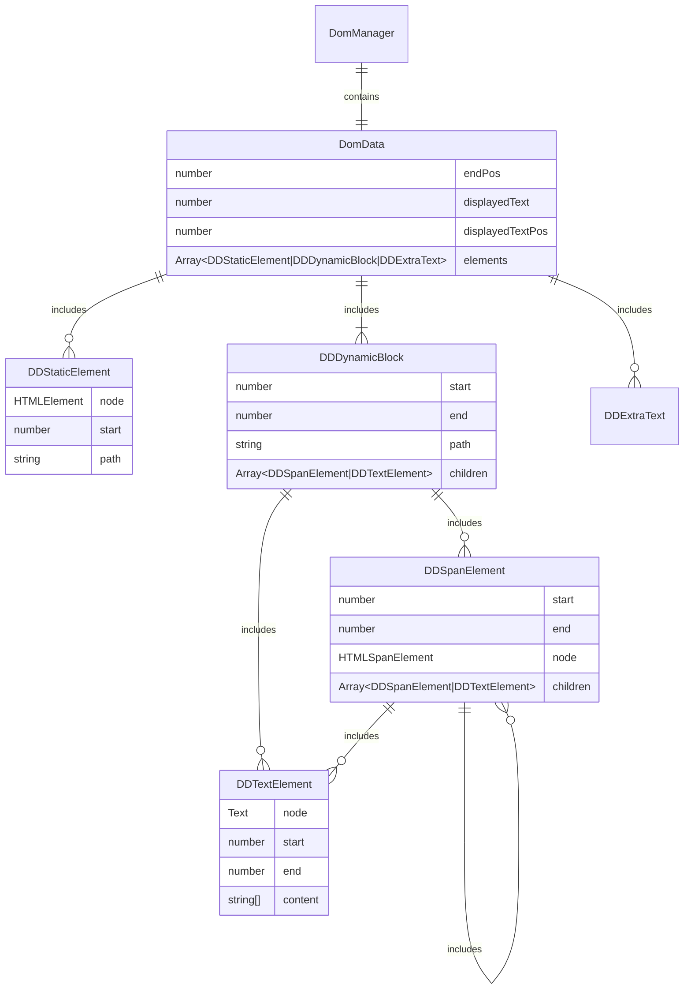
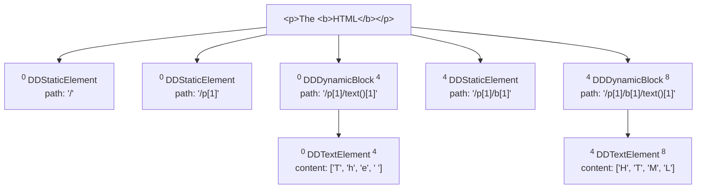
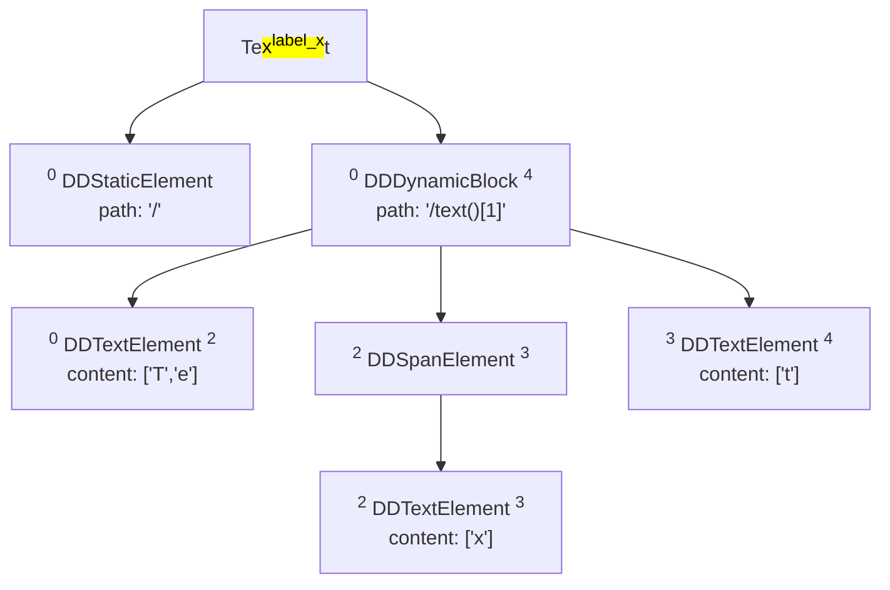
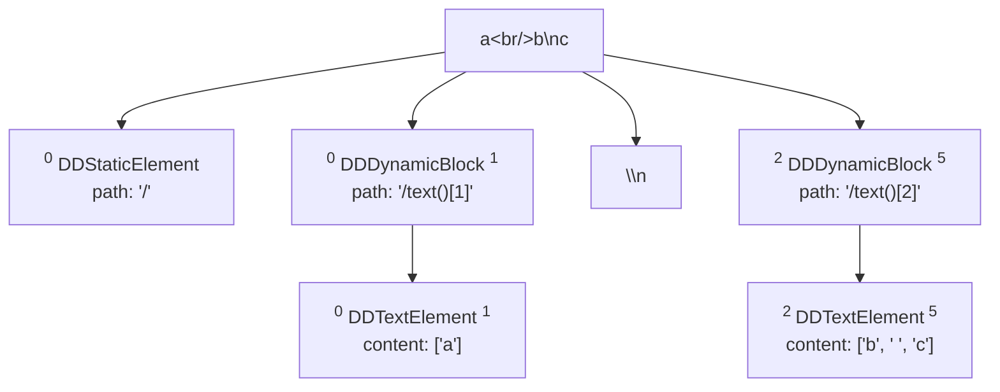
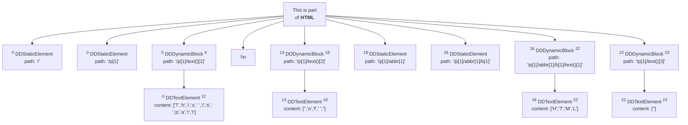

# DomManager

The primary role of `DomManager` is to provide an interface to the Document Object Model (DOM) 
and cache as much information as possible about it for optimization. Most of this data is collected 
right during the initialization phase when an instance is created, while the remaining details 
are fetched during interaction processes.

Simplified structure of `DomManager`:



### DomData


`DomManager` stores all needed data in the object being an instance of `DomData` class. 
This object stores representation of displayed content in the way it can be seen by users, 
which was achieved by using Selection Api. It also keeps in mind positions coming 
after the last processed element in displayed text and in the content of `RichText`. 
But all this is relevant only on the stage of initialization. 

The last field `DomData` contains is an array of elements that should represent the DOM tree itself. 
And that is the point of interest.

All elements being contained by `DomData` could be logically divided in two groups. 
The one that is static and never changes, they reflect the structure of the DOM.
And the other one where we store all highlight spans and texts.


### Structural elements

The first group consists of elements of types `DDStaticElement`, `DDDynamicBlock` and `DDExtraText`.
It’s a flat list on the first level of descendents and represents the default state 
of `RichText`’s content.


- `DDStaticElement` contains information about its related tag in DOM. It contains reference 
to its html-node, its start position calculated as an global offset and its xpath. 
The last two fields are used to search the right 
elements in DomData.
- `DDExtraText` is just a string. It has no real analog in DOM but it is what we get
when we work with Selection Api to collect text representation. For example in case 
when the content itself has some block elements or other line breaks. 
This exists only to be sure that all symbols of displayed text are accounted for 
in the region's text field.
- `DDDynamicBlock` is a container for managing all real text elements and highlighting spans 
that belong to regions. It provides slots for dynamically changing content. On the initialization 
it has relation only with one text node in DOM. It stores information of start and end 
of the editable block in terms of global offsets, xpath of its original text element 
and set of children elements.


### Content elements


The second group is sets of elements that dynamically change when regions are created and deleted. 
It is represented by elements of types `DDSpanElement` and `DDTextElement`.


- `DDSpanElement` is similar to `DDDynamicBlock` but it also can be created / deleted 
during the annotating, stores the reference to its highlighting span html-node and 
has a method to remove this span itself from DOM.
- The content of `DDTextElement` is an array of strings where each element 
on the one hand is a thing that is counted by global offsets as one symbol 
and on the other hand is a substring of displayed text 
so that there is no any character here that the browser does not provide as visible.


### Examples

#### Simple Html
The simple data `<p>The <b>HTML</b></p>` will be converted in this way:




#### A text with a region

A text `“Text"` with region over `“x”` would be represented as:




#### Replacing characters

The tricky content `a<br>b\nc` will be:


- `\n` is converted to space character as it is displayed in the browser.
- `<br>` becomes extra text element `\n` as it will be displayed as a line break.

#### Edge cases
There could be more complicated cases, for example when HTML is not well-formed.
```html
<p>This
is part<br/> of 
<abbr tytle="HyperText Markup Language"><b>HTML</b></abbr>
</p>
```
Is displayed in browser as:

This is part<br>
of <b>HTML</b>

And results in:


In the second text node we have a content `['','o','f',' ','']`

An empty string as a first element is a result of the fact that the browser does not display 
space at the beginning of the tag content.

An empty string as a last element is a result of the fact that the browser knows about the line break
in original html and also considers it as a character, but it does not display it.

### Content field
Displayed text is stored in the `content` field of elements. It is represented as an array of strings.
Each item in the array is a character displayed in the browser. 

Some of the characters are empty strings, that means that they are not displayed in the browser 
and cannot be got by Selection Api. But there are met in DOM's text nodes in `textContent`.
So to keep that information we store them in the `content` field as a placeholder.
But in the same time it can be used to calculate the global offset or range offset in the displayed text.

In case if we have text for annotating: `<p>🐱\nmeans cat</p>` the whole content will be:
`['🐱', ' ', 'm', 'e', 'a', 'n', 's', ' ', 'c', 'a', 't', '.']`
When we create region over the word `cat` we can:
- get the displayed text of the region by joining the content array from the 9th to the 11th element. 
(it is how it is displayed in the browser)
- get the global offset of the region. It is exactly the number of elements in the content array till 
the region. ([8, 11])
- get an offset of the range related to the region. For that we need to sum the length 
of the content of all elements and in case of empty string consider it as a one 
(even if it is hidden) character. ([9, 12])

